<div align="center">


# 🚀 Timesaver Nodes for ComfyUI

**A friendly toolkit of 73 production-ready nodes that take the boring busywork out of your ComfyUI graphs.**

> 11 of them belong to TS Image Studio — its own node plus the markers and backends it drives — and are not written up separately below; the reference covers the other 60.

Resize, color-grade, key, denoise, transcribe, translate, prompt-build, manage models — without leaving the canvas.

[](pyproject.toml)
[](https://github.com/comfyanonymous/ComfyUI)
[](https://www.python.org/)
[](LICENSE.txt)

🇷🇺 [README на русском](README.ru.md)

</div>

---

## ✨ What's Inside

Whether you build pipelines for image generation, video, audio, or just want to tidy up your prompts — Timesaver has a node for that.

|  | Category | Count | Highlights |
|---|---|---|---|
| 🖼️ | **[Image](#image)** | 29 | Resize, color, masks, keyer, tiling, 360°, Lama cleanup, Smart Inpaint, BiRefNet bg removal, ViTMatte, SAM3 picker |
| 🎬 | **[Video](#video)** | 9 | Frame interpolation, RTX/spandrel upscale, depth, animation preview |
| 🌈 | **[HDR / EXR](#hdr)** | 7 | Native LTX 2.5 HDR: EXR in, ACEScct working space, float32 decode, scene-linear master |
| 🎵 | **[Audio](#audio)** | 6 | Whisper transcription, Silero TTS, Demucs stem split, audio cropping |
| 🤖 | **[LLM](#llm)** | 2 | Qwen 3 VL multimodal chat, Super Prompt with voice input |
| 📝 | **[Text & Prompts](#text)** | 4 | Prompt builder, batch loader, style picker, Russian stress marks |
| 🎨 | **[Ideogram](#ideogram)** | 1 | Visual JSON-prompt designer for Ideogram 4 — text/object blocks, WYSIWYG node preview, per-area colours, layout/style/design presets, width/height output, RU/EN, import/export |
| 📁 | **[Files & Models](#files)** | 8 | Model scanner, FP8 converter, file path loader, EDL→YouTube chapters |
| 🛠️ | **[Utils](#utils)** | 5 | Workflow group bypass panel, custom sliders, math, smart type-aware switch |
| 🎨 | **[Conditioning](#conditioning)** | 1 | Multi-reference image conditioning |

> All 73 nodes use the **ComfyUI V3 API** (`comfy_api.v0_0_2.IO` — a pinned namespace, not a stable one: the adapter itself declares `STABLE = False`. Pinning keeps the pack off the moving `latest` alias; it does not promise the API will not change).
>
> **Plus extra samplers & schedulers** added straight into the native KSampler / KSamplerAdvanced / BasicScheduler dropdowns (no node to wire — they just appear after install): sampler **`res_2s`** (2nd-order exponential RK / "RES"), schedulers **`bong_tangent`** (two-stage arctangent sigma curve) and **`beta57`** (`beta` α=0.5/β=0.7). Algorithms reimplemented clean-room from [RES4LYF](https://github.com/ClownsharkBatwing/RES4LYF)'s public math (no code copied).

---

## 📑 Table of Contents

- [Installation](#-installation)
- [Quick Start](#-quick-start)
- [Updating](#-updating)
- [Node Reference](#-node-reference)
  - [🖼️ Image](#image)
  - [🎬 Video](#video)
  - [🌈 HDR / EXR](#hdr)
  - [🎵 Audio](#audio)
  - [🤖 LLM](#llm)
  - [📝 Text & Prompts](#text)
  - [🎨 Ideogram](#ideogram)
  - [📁 Files & Models](#files)
  - [🛠️ Utils](#utils)
  - [🎨 Conditioning](#conditioning)
- [Tips for Beginners](#-tips-for-beginners)
- [Troubleshooting](#-troubleshooting)
- [Repo Layout](#-repo-layout)
- [License & Credits](#-license--credits)

---

## 📦 Installation

### Option 1 — ComfyUI Manager (recommended)

1. Open ComfyUI Manager → **Custom Nodes Manager**.
2. Search for `Timesaver` and install.
3. Restart ComfyUI.

### Option 2 — Manual

```bash
cd ComfyUI/custom_nodes
git clone https://github.com/AlexYez/comfyui-timesaver
cd comfyui-timesaver
python -m pip install -r requirements.txt
```

Then restart ComfyUI.

> 🪟 **Windows portable build**: run `pip` from the bundled Python (e.g. `python_embeded\python.exe`), otherwise dependencies will land in the wrong interpreter.

> 🍎 **macOS / Linux**: use the same Python that ComfyUI runs with. Activate your venv before `pip install`.

### Optional dependencies

A few nodes need extra packages — they fail gracefully and tell you what's missing if you try to run them without:

| Node | Needs | Install via extra |
|---|---|---|
| TS Cube ↔ Equirectangular | `py360convert` | (bundled in core) |
| TS Qwen 3 VL int4/int8 | `bitsandbytes` (no Apple Silicon wheel) | `pip install -e .[llm-quant]` |
| TS Music Stems | none for the RoFormer engines; `demucs` only for the legacy `htdemucs*` options | `pip install -e .[audio-stems]` |
| TS Silero TTS / Stress | `silero`, `silero-stress` | `pip install -e .[audio-silero]` |
| TS RTX Upscaler | `nvvfx` (NVIDIA RTX only) | install manually |
| TS Video Upscale With Model | `spandrel` | install manually |

> Want everything in one go? `pip install -e .[all]`

### Platforms

Windows, Linux and macOS on Apple Silicon. What differs on a Mac, measured on
GitHub's macOS runners rather than assumed:

- **Nothing extra to install for video and audio.** Every node that shells out to
  ffmpeg uses the binary `imageio-ffmpeg` ships, so a system ffmpeg is a fallback
  and not a requirement.
- **Metal is used where PyTorch implements the operator.** Two it does not —
  `linalg.eigh` and `linalg.lstsq` — are the ones TS Color Match needs, so that
  node quietly does those small solves on the CPU and keeps the rest on the GPU.
- **TS Whisper always runs on the CPU on a Mac.** openai-whisper does not run
  reliably on Metal, so the device is not offered rather than offered and broken.
- **int4 / int8 for TS Qwen 3 VL are unavailable**: `bitsandbytes` has no Apple
  Silicon wheel. The node notices and falls back to fp16/fp32 with a warning.

---

## 🎯 Quick Start

1. Launch ComfyUI.
2. **Right-click → Add Node** or double-click an empty area on the canvas.
3. Type `TS` in the search box — every Timesaver node has a `TS` prefix.
4. Pick a node, connect inputs/outputs, and run.

**Node naming convention:**

```
TS_<NodeName>     ← class id (used in workflows / search)
TS <Display Name> ← what you see in the UI
TS/<Category>     ← location in the right-click menu
```

**Most common output types:**

| Type | Means |
|---|---|
| `IMAGE` | A batch of frames `[B, H, W, 3]`, values in `[0, 1]` |
| `MASK` | Single-channel mask `[B, H, W]`, values in `[0, 1]` |
| `AUDIO` | `{"waveform": [B, C, T], "sample_rate": int}` |
| `LATENT` | A latent dict `{"samples": ...}` |
| `CONDITIONING` | A list of `(cond, meta)` pairs for samplers |
| `STRING` / `INT` / `FLOAT` | Plain values |

ComfyUI highlights compatible sockets for you while dragging — no need to memorise types.

---

## 🔄 Updating

Already installed via git?

```bash
cd ComfyUI/custom_nodes/comfyui-timesaver
git pull
python -m pip install -r requirements.txt
```

Restart ComfyUI. Node ids, inputs and defaults are frozen across versions, so saved workflows keep working.

> ⚠️ **One exception, 11 Aug 2026 (v11.0.0): 16 nodes were retired.** A workflow that used one of them shows it in red as a missing node; everything else in that graph is untouched. What was removed, why, and how to get it back is in [CHANGELOG.md](CHANGELOG.md).

---

<a id="-node-reference"></a>
## 📚 Node Reference

Every node below shows the actual look in ComfyUI (English UI). Click any image to see it full size on GitHub.

---

<a id="image"></a>
### 🖼️ Image (20 nodes)

Everything that touches pixels: resize, color, masks, background removal, keying, tiling, panoramas, and inpainting.

#### TS Image Resize
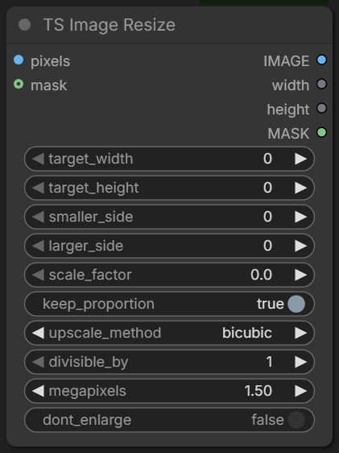

The resize node you actually want. Pick one of: exact target (`target_width` × `target_height`), one side (`smaller_side` / `larger_side`), megapixels, or a scale factor. Optional `divisible_by` snaps dimensions to a multiple required by samplers (8, 16, 32, …). `dont_enlarge` blocks upscales when the source is already smaller than the target.

**Use when:** preparing inputs for SDXL / Flux / WAN, batch-resizing photos to a maximum side, or matching a video frame size.

---

#### TS Resolution Selector
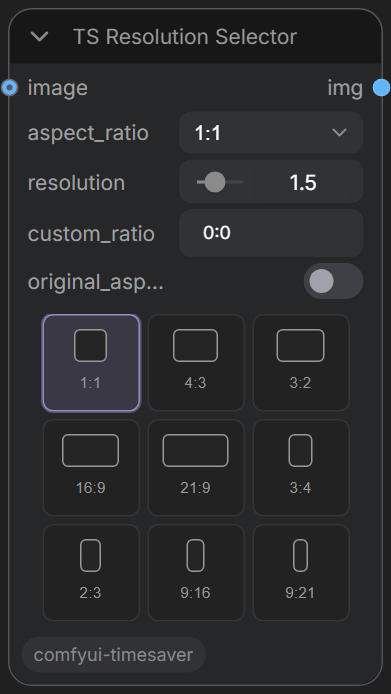

Visual aspect-ratio picker. Choose 1:1, 4:3, 3:2, 16:9, 21:9, 3:4, 2:3, 9:16, 9:21, or a custom ratio, then pick a target megapixel budget (0.5 – 4 MP). The output is a blank canvas with dimensions snapped to multiples of 32 — perfect as a `latent_image` source. If you connect an image, the node fits it onto the canvas; with `original_aspect=True` the ratio is taken from the image instead of the preset.

**Use when:** starting a generation from scratch with a fixed aspect, or normalising an arbitrary image into a latent grid.

---

#### TS Color Match
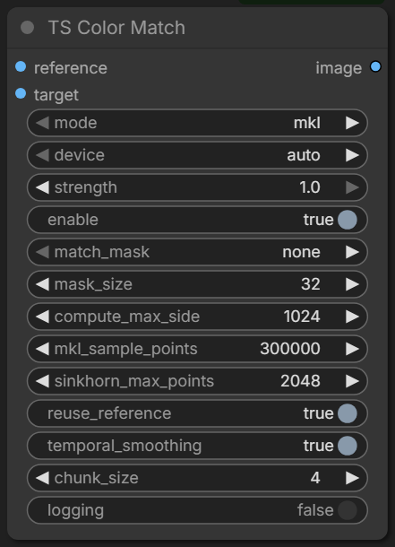

Transfer the colour palette from a `reference` image to a `target` batch. Two algorithms:

- **MKL** (default) — fast, stable, video-friendly with temporal smoothing.
- **Sinkhorn** — slower but more precise (optimal-transport based).

Includes match masks (`rectangle` / `ellipse` for stabilising on edges only), VRAM-aware chunking, and a `reuse_reference` flag for video.

**Use when:** colour-grading a video to match one keyframe, harmonising shots from different sources, or matching CG into plate footage.

---

#### TS Film Emulation
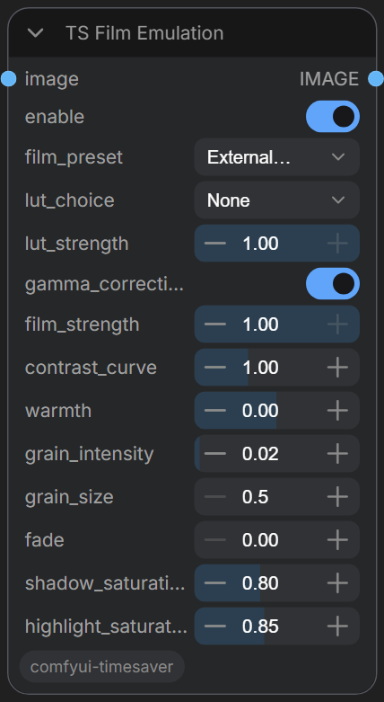

Built-in film stock presets (Kodak Portra/Vision3, Fuji, Cineon-style, …) plus optional `.cube` LUT loading from `models/luts/`. Adds gamma correction, contrast curve and a tunable `lut_strength`.

**Use when:** giving renders a cinematic feel without leaving the graph.

---

#### TS Remove Background (BiRefNet)
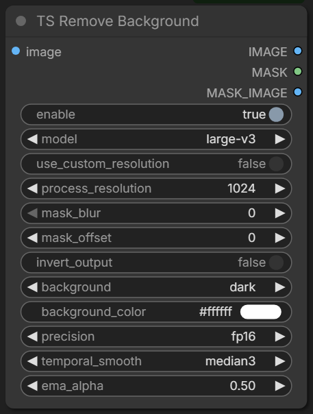

State-of-the-art background removal via BiRefNet. Outputs the cut-out image, an alpha mask, and a "mask preview" image. Options: model picker (HR-matting / general / portrait / DIS), `process_resolution` (with `use_custom_resolution` override), `precision` (auto/fp16/fp32), `mask_blur`, `mask_offset`, `invert_output`, `temporal_smooth` for video (`none`/`median3`/`ema` with `ema_alpha`), background mode (Alpha / colour via the COLOR widget). v9.4 cleanup removed the unstable `refine_foreground` option.

**Use when:** isolating subjects, building product shots, or feeding clean alpha masks into compositing nodes.

---

#### TS Lama Cleanup
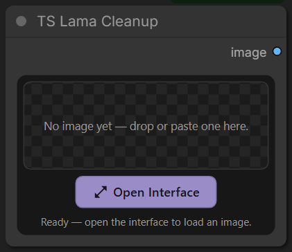

Built-in inpainting node powered by LaMa — paint a mask right on the node's canvas (brush + undo/redo + reset), then run to fill. Stores intermediate edits per session, no external Photoshop trip required. Since v9.3 the architecture is pure PyTorch (no upstream `lama-cleaner` dependency) and weights load from `.safetensors` in `models/lama/` instead of pickled `.ckpt`.

**Use when:** removing tourists from photos, erasing watermarks, fixing artifacts, prototyping cleanup before a heavier inpainter.

---

#### TS Smart Inpaint
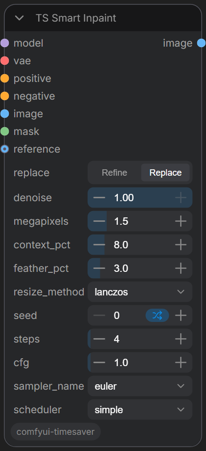

Mask-driven regenerate **or** refine in one node: feed the full image + a painted mask and it crops the region (+ context padding), upscales the crop to a megapixel budget, VAE-encodes, samples, then feather-composites and latent-blends the result back so untouched pixels stay bit-exact. The `replace` toggle picks the mode — **Replace** = Smart Inpaint, regenerating the masked area from scratch as a Kontext edit (the crop becomes `reference_latents`, denoise locked to 1.0); an optional `reference` image is chained as a second reference ("fill the hole with THIS"). **Refine** = an ADetailer-style partial-denoise pass at the `denoise` value, no reference. Headless port of ComfyUI-Angelo's "Xtra-Fine" inpaint path (MIT) — the crop + composite happen in-node, so the workflow only feeds the source + mask.

**Use when:** object replacement, generative fill, or a high-detail pass on a painted selection — without wiring up a manual crop → sampler → stitch chain yourself.

---

#### TS Langevin Inpaint
Inpaint sampler that spends extra inner steps at every noise level, so the repainted area agrees with the pixels around it instead of merely filling the hole. It replaces a plain KSampler: feed it a latent that carries a **noise mask**, and it returns the finished `LATENT`.

Why it exists: ordinary sampling looks at the masked region and its surroundings only through the model's own attention. Langevin dynamics adds a short corrective loop at each level (`think_steps` of it), pulled towards the known pixels with `guidance` and damped by `step_size`, `beta` and `friction`. The defaults are tuned for photographic content; raise `think_steps` when a seam is still visible, lower it when the patch turns mushy.

Works with any model family — no Fill checkpoint, no ControlNet.

**Use when:** a repaint has to blend into complicated surroundings (skin, fabric, foliage) and a normal sampler leaves a visible patch.

---

#### TS Universal Inpaint Sampler
The same idea as TS Langevin Inpaint, packaged as a **SAMPLER** you plug into ComfyUI's own `SamplerCustomAdvanced` instead of replacing the sampler node. Training-free and model-agnostic: no Fill checkpoint, no ControlNet.

Feed `SamplerCustomAdvanced` a latent whose noise mask marks the region to repaint, and hand it this sampler. `think_steps` sets how much correction happens at each noise level; `resample_strength` sets how hard the known pixels pull the masked ones towards them.

**Use when:** you already have a custom sampling chain (own sigmas, own guider) and want inpaint-aware sampling inside it rather than around it.

---

#### TS Matting (ViTMatte)
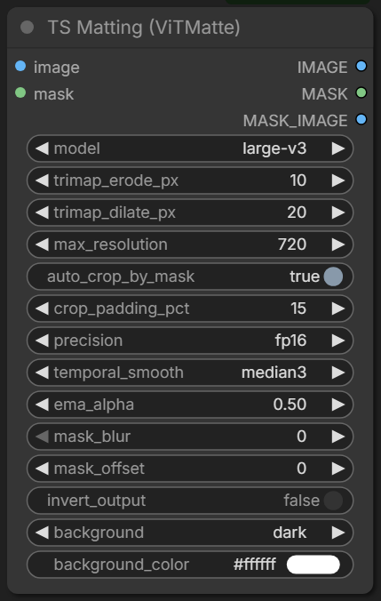

Guided alpha matting via Hugging Face ViTMatte. Takes an image + a coarse mask (e.g. from SAM3 Detect), auto-builds a trimap and refines into a photo-realistic alpha matte. Same `mask_blur`/`mask_offset`/`background` post-processing contract as TS Remove Background, so it's a drop-in upgrade when edges/hair/transparency matter. Models cached under `models/vitmatte/`.

**Use when:** producing crisp cut-outs from SAM-style masks without dropping into Photoshop.

---

#### TS SAM Media Loader
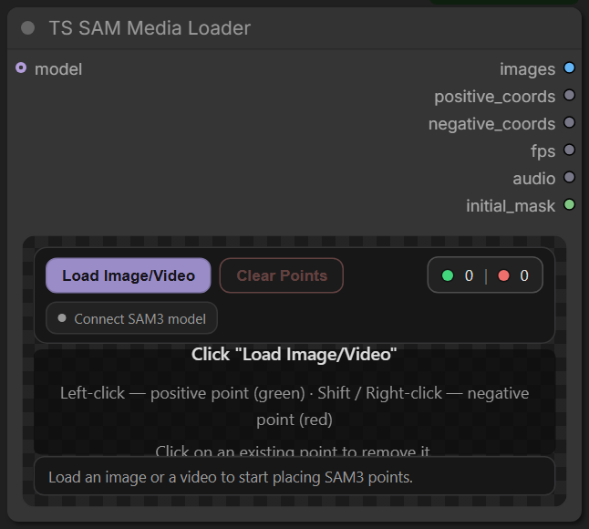

Loads an image or video and lets you click-pick positive/negative points right on a first-frame preview. Outputs `IMAGE`, `AUDIO` (for video), and `positive_coords`/`negative_coords` STRING JSON in the exact format expected by the native ComfyUI **SAM3 Detect** / **SAM3 Video Track** nodes. With an optional SAM3 `model` input it also returns the rendered `initial_mask` ready to feed into SAM3 Video Track.

**Use when:** building SAM3 segmentation/tracking workflows and you want a friendly UI for the seed points instead of typing JSON by hand.

---

#### TS Crop To Mask
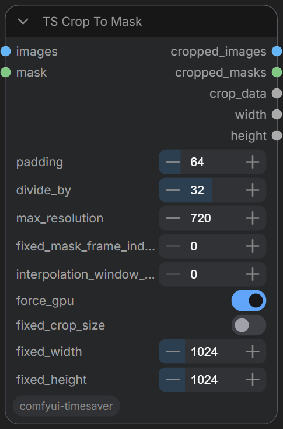

Crops a batch of images around a mask region with optional padding, max-resolution clamp, fixed aspect, and inter-frame smoothing for video stability. Outputs both the crop and a `crop_data` blob you can feed into…

---

#### TS Restore From Crop
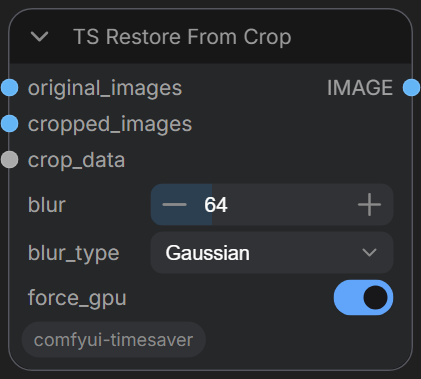

…this node to paste a processed crop back into the original frame, with feathered Gaussian or box blur on the seams. The classic crop-and-restore workflow for processing only the interesting region with a heavy model.

**Use the pair when:** running an upscaler or face restorer on a small ROI of a high-resolution image without burning VRAM on the full frame.

---

#### TS Image Tile Splitter
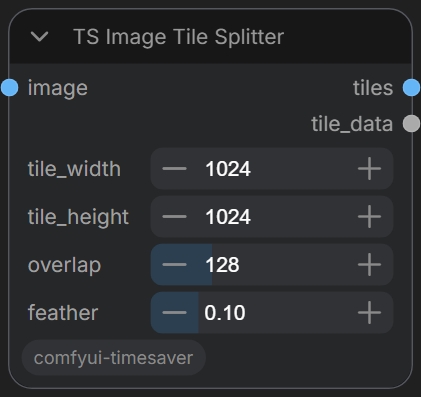

Splits a large image into overlapping tiles for tile-based processing. Configurable tile size, overlap, and feather amount. Outputs the tile batch + a `TILE_INFO` metadata blob.

---

#### TS Image Tile Merger
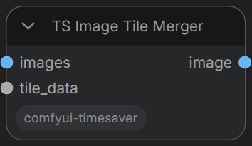

The other half: takes the processed tile batch and the `TILE_INFO` and stitches them back into one image with proper feathered blending in the overlap regions.

**Use the pair when:** running tile-based upscaling, denoising, or any process that doesn't fit a 4K frame in VRAM.

---

#### TS Auto Tile Size
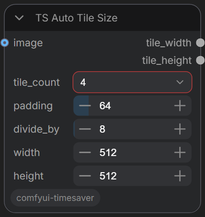

Pick `tile_count` (4, 8, 16) and the node figures out the best `tile_width` × `tile_height` for an image, respecting padding and a `divide_by` divisor. Pairs naturally with the splitter/merger above.

---

#### TS Image Batch Cut
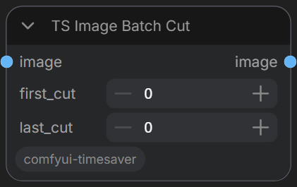

Trim N frames from the start (`first_cut`) and N frames from the end (`last_cut`) of an image batch. Negative values are treated as zero; an over-cut returns an empty batch.

**Use when:** trimming intro/outro frames from a video, dropping the warm-up frames of a sampler, or splitting a batch into segments.

---

#### TS Smart Batch
Batch images — and keep working when one of them is not there. Inputs **grow**: fill the last slot and the next one appears, up to 32. Every slot is **optional**, so an empty or bypassed one is simply skipped. Nothing connected at all is the only error, and it says so plainly instead of handing you a blank frame.

Why it exists: core's **Batch Images** has two *required* inputs, so muting or bypassing either side breaks the whole graph before it even runs. Building a first-frame / last-frame pair usually means switching one side off and on again, and that should not require rewiring.

Frames come out in slot order — `image0`, `image1`, `image2`, … — whatever gaps you leave. Pairs are reconciled exactly as core does: a missing alpha channel is padded with 1.0, and a differently sized image is resized to match the first one that actually arrived. Batches concatenate — 3 frames plus 2 frames give 5.

**Use when:** feeding an FLF (first/last frame) video model, or any time one node should emit a batch of however many sources happen to be switched on.

---

#### TS Image Batch to Image List / TS Image List to Image Batch
<table>
<tr>
<td>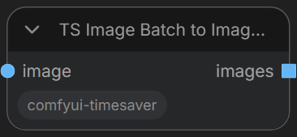</td>
<td>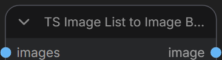</td>
</tr>
</table>

Convert between `IMAGE` (a single batched tensor) and `IMAGE` list (a Python list of single-frame tensors). Needed when one node expects a batch and the next wants per-frame iteration.

---

#### TS Get Image Megapixels
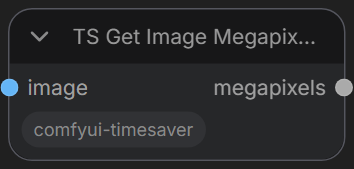

Returns the megapixel count of an `IMAGE` as a `FLOAT`. Two-line node, but indispensable for routing logic ("if image > 4 MP, downscale first").

---

#### TS Get Image Size
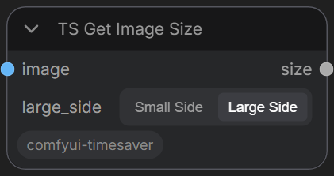

Returns the larger or the smaller side of an image as `INT`. Toggle the boolean to switch between the two.

---

#### TS Image Prompt Injector
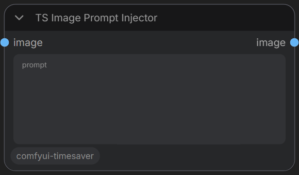

Injects a custom string into the workflow's positive prompt at runtime — useful when you generate prompts dynamically (LLM nodes) and want them to land in the actual `CLIPTextEncode` connected to the sampler. Operates on the workflow graph, leaves the image unchanged.

**Use when:** chaining an LLM that writes prompts and you want the next sampler to use the result without manually rewiring text encoders.

---

<a id="video"></a>
### 🎬 Video (8 nodes)

Reading and writing video files, frame interpolation, model-based upscale, depth, animation preview.

#### TS Video Loader
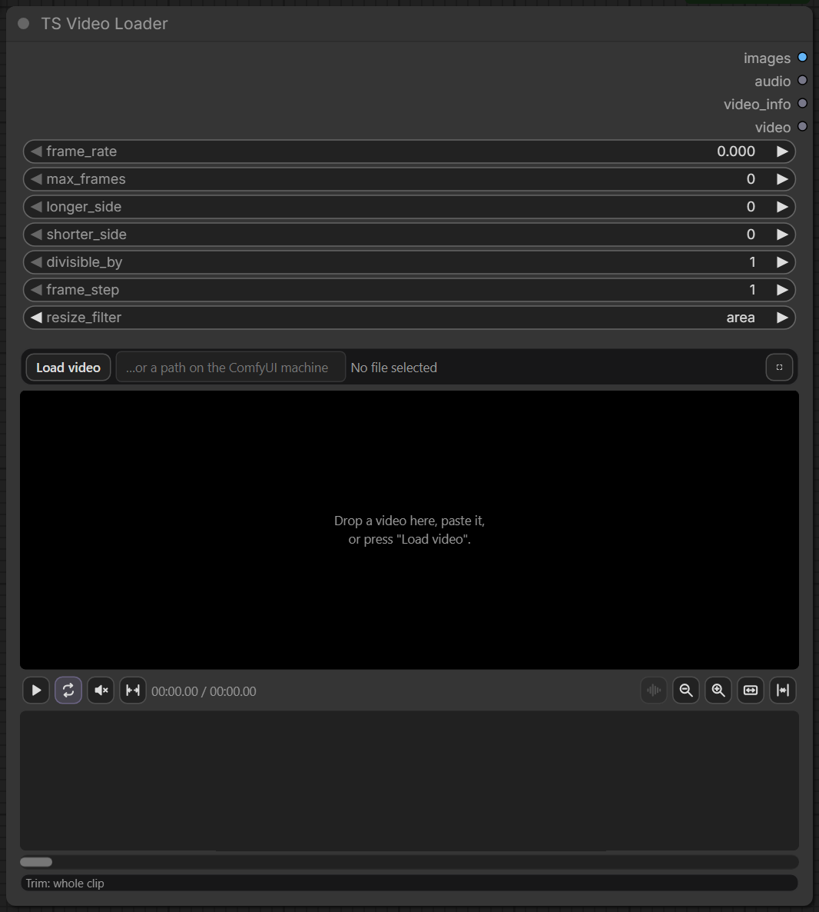

Reads a video into frames, audio and a compact `video_info` bundle — and lets you pick the piece **visually**. The node's body holds a player and a timeline with a filmstrip: drag the handles to set in and out, zoom into a single second of an hour-long take (Ctrl/Cmd + wheel), and loop the selection while you judge it. Type an exact timecode when the mouse is not precise enough.

**It is fast on purpose.** All resizing, rotation and colour conversion happen inside the decoder's own filter graph, and reading stops at the end of your selection — a two-second piece of an hour-long 4K take costs a seek plus two seconds, not an hour. Measured on a 4K clip: 0.43 s where the naive path (decode at full resolution, then resize) takes 5.9 s and 6.4 GB.

**The sound track is drawn under the filmstrip** whenever the file has audio — a beat or a spoken word is far easier to hit by the wave than by the picture — and the player follows the handle you drag, so the exact frame that will become the first or the last one is on screen while you are still choosing it.

`frame_rate` resamples by real timestamps, so a variable-frame-rate source comes out evenly spaced. Size is set as `longer_side`/`shorter_side` rather than width and height, so one graph fits landscape and portrait footage alike; either may be `0` to derive it from the other. `divisible_by` rounds down to what video models want, the scaling filter defaults to `area` (footage is almost always scaled down, and averaging beats interpolation there), and `max_frames` is the memory guard. The ceiling for the frames comes from the machine (60% of its RAM, never below 8 GB; `TS_VIDEO_MAX_BYTES` overrides it), so a 13-second 4K clip loads on a 64 GB box instead of being turned down. When the frames genuinely will not fit, `when_too_large` = `use disk` puts them in a memory-mapped file in the ComfyUI temp folder: what comes out is an ordinary IMAGE and the allocation cannot fail, at the price of disk traffic (measured: 31.9 GB in 92 s against 51 s in RAM).

Footage arrives by **drag and drop** — from the file manager, from the Artius browser, or from another node's preview — by the button, by paste, or as a path to a file anywhere on the ComfyUI machine.

> **A path anywhere on the machine — and what happens when the server is not yours alone.** Running ComfyUI the usual way, on `127.0.0.1`, the node and its preview read **any path you give them**: Documents, Desktop, another drive. Nothing is copied into `input`, which is the whole point — that folder grows without end otherwise.
> If ComfyUI is started open to a network (`--listen 0.0.0.0`, a LAN box, a cloud machine), the preview is served over HTTP to whoever can reach that port, so it then stays inside your home folder and ComfyUI's own directories. Add more with `TS_MEDIA_EXTRA_ROOTS=D:/footage` (several separated by your OS path separator), or lift the limit with `TS_MEDIA_ALLOW_ANY_PATH=1`. Both are set on the machine by its owner — not inside a workflow, which can arrive from anyone.

**Use when:** any workflow that starts from footage rather than from a still.

---

#### TS Video Info
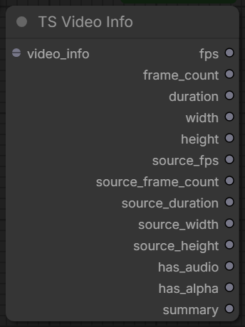

The small companion that unpacks `video_info` into plain numbers: frame rate, frame count, duration and size — both as loaded and as stored in the file — plus `has_audio`, `has_alpha` and a one-line summary. Keeping them here rather than on the loader saves the loader from carrying fifteen output sockets nobody connects at once. A `VHS_VIDEOINFO` bundle from Video Helper Suite plugs in too.

---

#### TS Video Saver
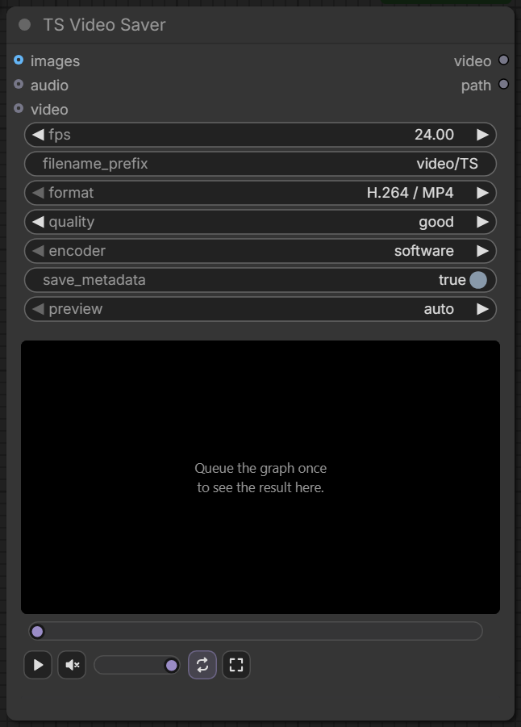

Writes frames to a video file and plays the result in the node. Format and quality are named in words — **MP4 / H.264** with draft…lossless, **MP4 / H.265** — about half the size at the same quality, with an optional 10-bit — or **MOV / ProRes** with the usual Proxy…4444 XQ profiles — not in encoder flags. Audio is muxed **in the same pass, into the same file**: no temporary WAV, no second ffmpeg run, no `-audio` duplicate on disk.

**Encoding shows its progress on the node**, the way sampling does: a long clip takes minutes, and a silent node during that time looks stuck.

The player remembers whether you turned sound on. ProRes is not playable in a browser, so the node writes a small H.264 proxy next to it just for the preview (`preview: off` skips that). Hardware encoding is available but never chosen for you: it is much faster and noticeably worse at the same file size.

**An EXR sequence** is the fourth format: one scene-linear float32 (or 16-bit half) file per frame, in its own folder, written from the `hdr_image` socket without touching the range. That socket exists because the ordinary `images` input is clamped to 0..1 long before the saver sees it. There is no compression option — this encoder does not offer one. The sequence carries no audio; a small H.264 proxy is written in the same pass so the node still has something to play.

**Use when:** you want the finished clip on disk, in a format an editor will actually accept — or the HDR master as frames a compositor will accept.

---

#### TS Animation Preview
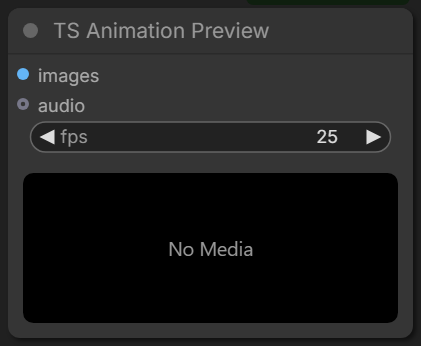

Drop-in preview node for image batches. Renders a looping H.265 video right inside the node with optional audio track sync. Beats running a sampler twice to see your animation.

**Use when:** previewing video output before spending VRAM on the final encode, or QA'ing frame interpolation results.

---

#### TS Frame Interpolation
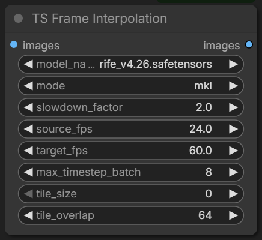

Smooth frame interpolation using RIFE / FILM models. Boost a 12 fps animation to 24/48/60 fps, or smooth jittery video.

**Use when:** the model output is choppy and you want cinema-smooth motion.

---

#### TS RTX Upscaler
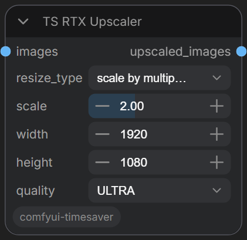

Hardware-accelerated upscale via NVIDIA RTX Video Super Resolution (`nvvfx`). Four quality levels (LOW/MEDIUM/HIGH/ULTRA), batched processing. **Requires an RTX GPU.**

**Use when:** you have an RTX card and want speed-of-light upscaling for video.

---

#### TS Video Depth
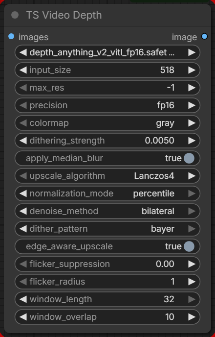

Depth map for a sequence, using **Video Depth Anything** over a sliding window
of frames so the result does not swim from one frame to the next.

Anything that fits inside one window is now run as a single window of exactly
its own length, instead of being padded out with copies of the last frame —
an input the model has never seen in training.

`flicker_suppression` blends in a temporal **median** of the depth, which drops
single-frame pops without smearing real movement the way an average would.
`flicker_radius` sets how many frames it looks at. `window_length` and
`window_overlap` expose the sliding window itself — leave them alone unless you
are trading VRAM for consistency.

Weights are fp16 safetensors, downloaded on first use: half the download, and
they load in hundredths of a second rather than a full one. Measured against
pure fp32 the depth differs by 0.02% of its range, which is nothing. The older
`.pth` files stay selectable so existing workflows keep working.

**Use when:** driving a depth ControlNet on a clip, building a parallax or 2.5D
move, masking by distance over time.

For a still, reach for **TS Image Depth** below — same family of models, but
the one that was actually trained on single pictures.

---

#### TS Image Depth
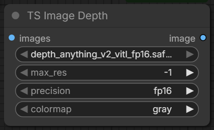

Depth map for a still, or for a batch of pictures that have nothing to do with
each other. Runs **Depth Anything V2 Large** on every picture on its own.

Why it is a separate node rather than a switch on the video one: the video model
has no way to look at a single picture except as 32 duplicated frames, and that
flattens the depth range — measured on a portrait, the face and hair blow out to
flat white and the structure is gone. It also forces the short side to 518 px, so
a 1600 px photo went into the model at 784x518 and came back visibly soft.

The pipeline is the reference one, on purpose and with nothing added: trim the
sides to a multiple of 14, run the model, normalize **each picture on its own**
min/max, resize back bilinearly. No denoise, no dither, no guided upscale — those
were built for video, and on a still the guided filter put a halo on contours.
Measured against the reference implementation, the map differs by **0.36%**,
which is under one 8-bit level, at identical detail.

`max_res` is the only control that matters: the longest side the picture is
processed at, snapped down to a multiple of 14. `-1` — the default — is native
resolution, so nothing is resampled at all. Lower it to trade sharpness for
speed and VRAM; on out-of-memory the node retries at half the size, logging each
step.

Weights are fp16 safetensors, downloaded on first use. Only safetensors are
offered in the list, but a workflow that still names an old `.pth` keeps
working — the file is simply no longer suggested.

**Use when:** a depth ControlNet on a single image, a 2.5D still, relighting or
masking by distance, or feeding a 3D reconstruction.
---

#### TS LTX First/Last Frame
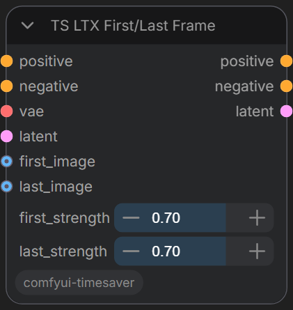

Apply LTX-Video keyframe conditioning for the first and (optionally) last frame in one node — equivalent to chaining two `LTXVAddGuide` nodes, with cleaner UX.

**Use when:** you have specific start/end frames and want LTX to interpolate between them.

---

<a id="hdr"></a>
### 🌈 HDR / EXR (7 nodes)

The native HDR path of LTX 2.5, as a set of nodes. It is **off by default and costs
nothing while it is off**: with the switch down, no EXR is read, no float32 VAE is
loaded, and the graph behaves exactly as it did before these nodes existed.

**What this is not:** it does not invent HDR out of an SDR clip. It preserves the HDR
that came in — from EXR guide frames, through the model, out to an EXR master.

A wired example with notes on the canvas: [`example_workflows/08_ltx25_native_hdr.json`](example_workflows/08_ltx25_native_hdr.json). It is the HDR half only — drop your own two-stage LTX graph around it, as the notes explain.

Why the ordinary nodes cannot do it: `Load Image` flattens anything above 1.0 to 1.0
without saying so, and `LTXVPreprocess` pushes the frame through an H.264 round-trip
and 8-bit bytes (`(image * 255.0).byte()` in the core source). Both are fine for SDR
and fatal for HDR, so the HDR branch bypasses them entirely.

---

#### TS LTX HDR Settings

One switch for the whole path. Everything else reads this node, so a single checkbox
changes the mode of the entire graph instead of five settings that must agree.

`input_color_space` says what the EXR files already are — `ACESCG`, `SRGB_LINEAR` or
`ACESCCT`, the same three the official `--hdr` flag takes. The preview controls live
here too, next to the switch, which is the point: exposure and tonemap belong to what
you look at, never to what gets written.

`hdr_mode` picks which of the two HDR technologies this graph uses, and they are
genuinely different, not two shades of one:

- **preserve HDR from EXR (ACEScct)** — the native LTX 2.5 path. The range came in
  from an EXR and the job is not to lose it. Working curve ACEScct, code 1.0 = linear
  **222.86**, and the output converts AP1 → Rec.709.
- **expand HDR from SDR (LogC3 IC-LoRA)** — the HDR IC-LoRA. There was no range on
  the way in; the model grows it out of ordinary SDR. Working curve LogC3, code 1.0 =
  linear **55.08**, and ⚠️ **the primaries are left alone** — the model already emits
  the right ones, so applying the ACES matrix here would shift the colour. Our inverse
  curve matches the official `LTXVHDRDecodePostprocess` to within 1e-6, measured over
  501 points.

In expand mode the guide is an ordinary SDR image and no EXR is read at all: you wire
the IC-LoRA into the model yourself, the same way the official 2.3 workflow does. The
LoRA is validated on LTX 2.3; support for 2.5 is officially in development.

**Use when:** always, if you use any of the other nodes here.

---

#### TS LTX Load HDR EXR

Reads an EXR as linear float32 — no normalisation, no upper clamp. Reports the range
and, in particular, **what share of the frame is above 1.0**. If that is zero, the
highlights were already lost upstream and the rest of the path has nothing to preserve.

Three backends: **OpenImageIO** (what the official pipeline uses, rarely installed),
**PyAV** (ships with ComfyUI, needs no setup — the default in practice) and **OpenCV**
(only reads EXR when `OPENCV_IO_ENABLE_OPENEXR=1` was set *before* ComfyUI started;
setting it later does nothing, because the reader registers at import).

Half-float files — what almost everyone actually renders — work too. That needed the
frame's raw planes to be read by hand: PyAV cannot convert `gbrpf16le` to an array at
all, and any format conversion goes through swscale, which clamps float data to
`[0, 1]`. Measured: a 4-channel EXR holding 4.0, read the convenient way, comes back
as 1.0.

**Use when:** the guide frames for your shot are renders, not screenshots.

---

#### TS LTX HDR Guide

One node per guide frame — first, last — that both picks the branch and prepares it.
Off, the SDR image passes through untouched; on, two guides are built from the EXR.

**The half-resolution guide is built from the original, not by shrinking the full one.**
The official two-stage pipeline rebuilds image conditioning for each resolution, and
that is not the same thing: averaging belongs in linear light, not in log codes.

The lazy inputs are the reason the switch is free. With HDR off, ComfyUI never walks
into the EXR branch; with it on, the `LTXVPreprocess` chain is never computed. A broken
EXR path cannot break an SDR run.

Strict validation catches stage sizes that do not match either legal wiring — the same
size (no latent upscaler) or exactly double (with the x2 upscaler).

A run guided by an **ordinary JPG or PNG** is supported too, through the
`image_guide` input — for when you generate video from a picture and still want a
float32 scene-linear master out. Be clear-eyed about what that gives you: an 8-bit
picture holds nothing above 1.0, and no curve invents what was never captured.
Recovering highlights from an SDR still is SDR→HDR expansion, a different model
technology, and this is not it.

What you do get is worth having anyway. The gamma is removed properly — feeding
sRGB codes in as if they were linear light is off by up to **2.3 stops** in the
shadows (measured: 0.131 of the ACEScct code range) — the master stays float32
scene-linear with no banding and no baked-in gamma, and the working range keeps
its headroom: SDR white sits at ACEScct code **0.555**, so **45% of the range,
7.8 stops, is left above it** for the model to generate into. Whether it actually
does is an empirical question — that is what TS LTX HDR Stats is for.

To use it, turn HDR on and bypass the EXR loader: the guide falls back to
`image_guide` on its own, no extra switch.

**Use when:** feeding first/last frames into a two-stage LTX graph.

---

#### TS LTX Final Latent Selector

Picks the first- or second-stage latent **before** the decode, instead of decoding both
and throwing one away. The inputs are lazy, so switching the upscaler off stops costing
sampler time, not just decoder time — and one decode downstream means one place where
the HDR conversion happens.

**Use when:** your graph has a two-stage switch. It is worth wiring even without HDR.

---

#### TS LTX HDR VAE

The same VAE file at an explicit precision. The stock `Load VAE` does not ask: model
management picks bf16, which is plenty for a picture and not enough for a master —
the quantisation step in the shadows and the top stops is exactly where HDR lives.

Everything else stays on the VAE you already had: guide encoding for both stages, the
latent upscaler, ordinary SDR decode. Wire this one **only** into the decoder's
`hdr_vae` input — that input is lazy, which is what keeps a second copy of a video VAE
out of memory while HDR is off.

**Use when:** HDR is on. Otherwise leave it unwired.

---

#### TS LTX HDR Decode

The single final decode, with two outputs that must never be confused:

- `preview_sdr` — what you look at: tonemapped, exposure applied, sRGB encoded.
- `hdr_linear` — what you save: scene-linear Rec.709 float32, no tonemap, no gamma,
  **no upper clamp**. No preview setting touches it.

While HDR is off the master slot returns an `ExecutionBlocker`, so a connected EXR
saver does not run at all — no stub file, no black frames, nothing.

The decode itself comes out as an ACEScct working signal in `[0, 1]` — which is why
ComfyUI's standard `(x + 1) / 2` clamp on the LTX VAE costs nothing here. The range
reappears on the inverse curve, after the decoder.

**Use when:** replacing the pair of VAEDecode nodes at the end of a two-stage graph.

---

#### TS LTX HDR Stats

Lost HDR looks completely normal. The picture is the same, the file was written, no
errors — there is simply nothing above 1.0 in it, and that is discovered in the edit,
when someone tries to pull the sky back.

This node answers "is the range still there?" with numbers: percentiles, share of
samples above 1.0, dynamic range in stops, negatives, NaN/Inf. It also warns when the
highlights are pressed against the ACEScct working ceiling — code 1.0 corresponds to a
linear luminance of about **222.86**, roughly 7.8 stops over white, and anything
brighter was flattened on the way into the model.

**Use when:** the first time you run a shot, and any time an EXR looks suspiciously tame.

---

<a id="audio"></a>
### 🎵 Audio (6 nodes)

Speech-to-text, text-to-speech, music separation, a waveform visualizer, plus a friendly audio loader and preview.

#### TS Audio Loader
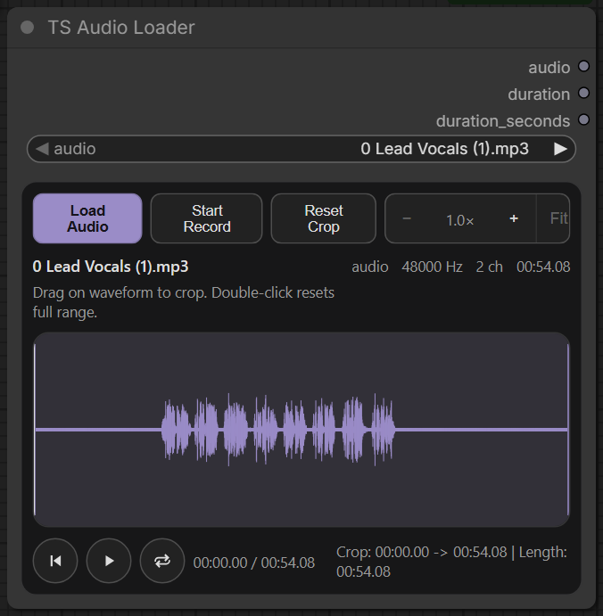

The audio loader you'd build yourself if you had time. Loads audio from any media (mp3/wav/mp4/mov/…), shows a real waveform, lets you crop visually by dragging on the waveform, and can even record from the microphone right inside the node. Outputs both the `AUDIO` waveform and a `duration` int.

**Use when:** preparing voiceovers, music beds, or any audio that needs trimming before processing.

---

#### TS Audio Preview
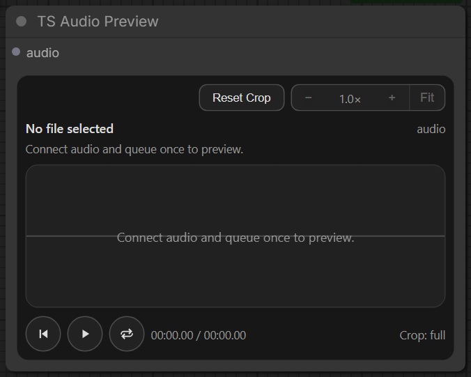

Same waveform UI as Audio Loader, but for previewing an audio output from upstream nodes. Looped playback, crop ranges, persistent state.

**Use when:** auditioning the result of a TTS / Stem split / processing chain without saving a file.

---

#### TS Whisper
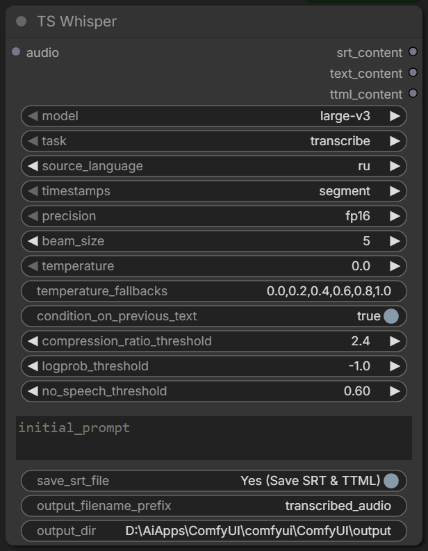

Speech-to-text on the native OpenAI Whisper engine shared with TS Super Prompt voice (same weights + in-memory model cache). Pick **Whisper large-v3** (best quality) or **large-v3-turbo** (faster). Outputs SRT (timestamps), plain text and TTML at once; segment- or word-level timestamps, language / translate-to-English, beam search and temperature fallbacks.

**Use when:** transcribing voiceovers, generating subtitles, or extracting text from podcasts before LLM processing.

---

#### TS Silero TTS
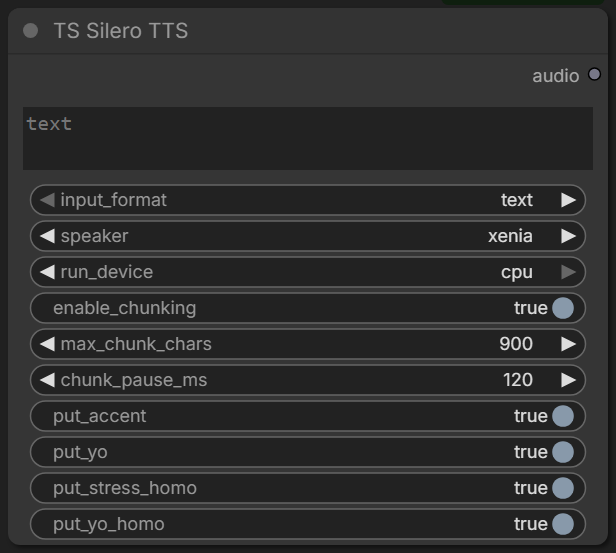

Russian text-to-speech via Silero TTS v5_3. Five speakers (aidar, baya, kseniya, xenia, eugene), text or SSML input, automatic chunking for long texts.

**Use when:** generating Russian voiceovers, audiobook drafts, or YouTube narration.

---

#### TS Music Stems
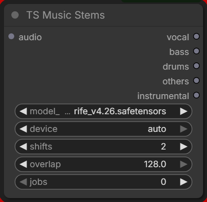

Splits music into stems, with the engine chosen by `model_name`.

**BS-RoFormer SW** is the default and gives six: `vocal`, `bass`, `drums`,
`guitar`, `piano`, and `others` for everything left over. **Mel-Band RoFormer**
gives only vocals and instrumental — and is the better choice when that is all
you want, because a specialist spends its whole capacity on the one boundary
that matters instead of splitting it six ways. Both are transformers and both
are a clear step up from what came before. **Demucs** (`htdemucs`,
`htdemucs_ft`, `hdemucs_mmi`) is still selectable so that workflows saved
before this change keep producing exactly what they always produced.

**The stems add back up to the mix.** Mask separation does not do that on its
own — the error is easy to hear in a null test. So one stem is not taken from
the model at all: it is the mix minus everything else, which makes the set
exact by construction. Measured on real music: `vocal + instrumental` nulls
against the source at 161 dB, and the six stems sum to it at 144 dB, which is
the floating-point floor rather than a modelling error.

**Outputs a model cannot produce are blocked, not silenced.** Ask Mel-Band for
drums and that branch of the graph simply does not run. A silent stem would
look like a broken model and cost you an afternoon.

`precision` picks fp16 or fp32 for the RoFormer engines. fp16 runs about twice as
fast on half the VRAM, and its error against fp32 was measured at -61 dBFS or
below on real music — under the noise floor of the recording. bfloat16 is not
offered: these models build their mask through `view_as_complex`, which does not
accept it. `shifts` and `jobs` apply to Demucs only.

The weights download once on first use, into `models/roformer/`. If you already
have the Mel-Band checkpoint from another pack it is found where it lies rather
than fetched again.

**Use when:** isolating vocals for remixing, extracting karaoke instrumentals,
or feeding cleaner stems into another model.

---

#### TS Audio Visualizer
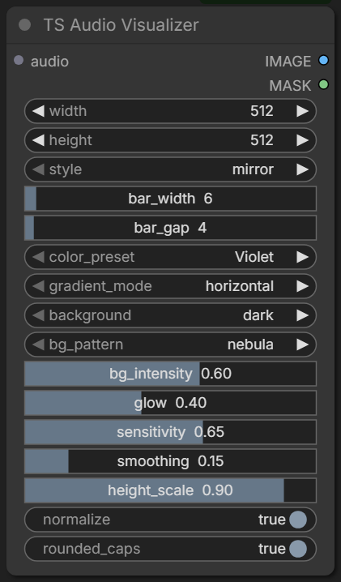

Turns any `AUDIO` clip into a stylized SoundCloud-style waveform image at the resolution you choose. Blue→violet gradient bars (default `Violet`; `Indigo`, `Neon`, `Spectrum`, `Fire` and more) are drawn as antialiased rounded capsules with a soft neon glow, sitting over an **audio-reactive abstract background** driven by the same loudness envelope: `nebula` (layered mountains + waveform aura), `glow`, `mountains`, `plasma`, or `none`. Rendered entirely on torch — no extra dependencies. Outputs both the `IMAGE` and a `MASK` (bar fill + glow alpha) so you can composite the bars over video or footage. Mirror or bottom bars, horizontal / vertical / amplitude-driven gradient, plus glow, background intensity, sensitivity, smoothing and bar geometry controls.

**Use when:** building music-video overlays, audiogram clips for social, or a quick visual for a voiceover / track.

---

<a id="llm"></a>
### 🤖 LLM (2 nodes)

Multimodal LLM-powered prompt enhancement and image understanding.

#### TS Qwen 3
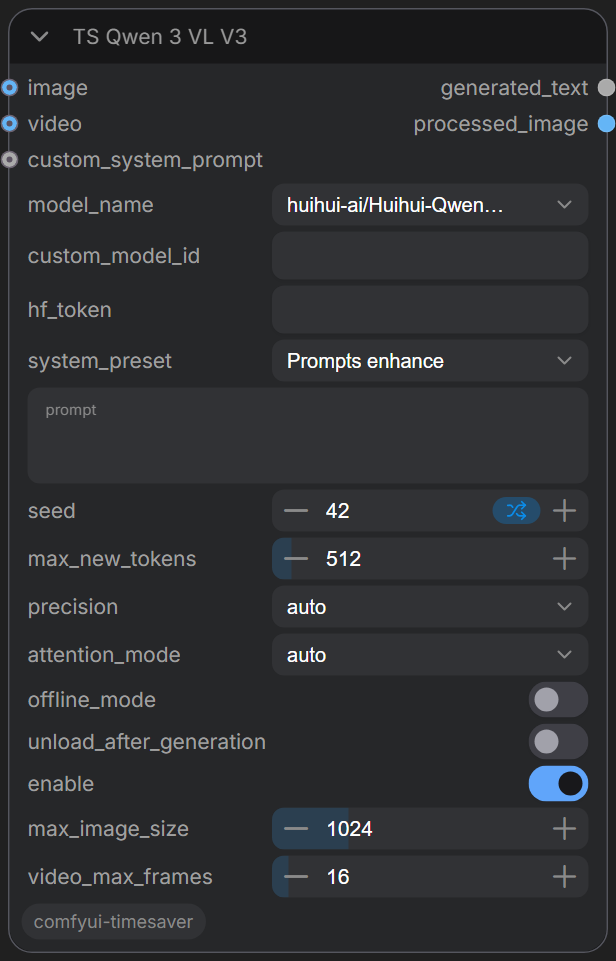

Multimodal Qwen 3 VL (image + video + text) running locally. Built-in model picker (Qwen 2B / 4B / 8B variants and uncensored mods), system-prompt presets ("Image Edit Command Translation", "Prompt Enhancement", …), 4-bit/8-bit quantisation via `bitsandbytes`, FlashAttention-2 support, on-the-fly download from HuggingFace. Since v9.5 the heavy pipeline lives in a shared `nodes/llm/_qwen_engine.py` reused by Super Prompt — bug fixes and perf improvements land in both nodes at once.

**Use when:** describing images for prompts, translating user intents into edit commands, building VLM-driven pipelines.

---

#### TS Super Prompt
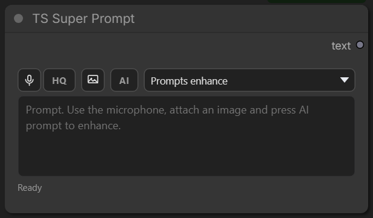

Prompt enhancement node with a built-in **voice button** — speak your idea, Whisper transcribes it (with cinematography-aware grammar fixes), then a small Qwen3 model expands it into a rich prompt. Optional image input for image-conditioned prompting. Two modes: fast turbo or high-quality. Internals split (v9.5) into `nodes/llm/super_prompt/` (`_helpers`, `_voice`, `_qwen` over the shared Qwen engine) so the prompt-enhancement path stays in sync with TS Qwen 3 VL V3.

**The model is never downloaded silently.** If it is not on the machine yet, pressing the enhance button first opens a dialog: which model, exactly how large (the real repository size, asked of the Hugging Face API without fetching a byte) and which folder it will land in. *Not now*, Escape, or a click outside all mean no, and nothing is downloaded. Agreeing is remembered for the session, so it asks once rather than on every press.

**And the library is checked first.** Before any download the node asks the hub what architecture the model is and compares it with what the installed `transformers` knows. If it cannot load it, the run stops immediately with the model type, the installed version and the command that fixes it — instead of spending minutes and gigabytes to reach the same conclusion. The check asks the library what it supports rather than comparing version strings, so a build from git or a partial upgrade is judged on what it can actually do. The default model is a Qwen3.5 and needs `transformers` **5.2.0** or newer.

**Two reference images.** Drop an image straight onto the node — from the Artius browser, from the desktop, or from another node's preview. One image is a reference; drop a second and the two become the **first and last frame** of the shot, which the model is told explicitly. The second picker appears once the first is taken. The thumbnails carry a **1** and a **2** so you can see which frame is which; drag one onto the other to swap them. Remove the first of a pair and the second takes its place.

**Frames can come from the graph too.** The optional `images` input takes a plain ComfyUI `IMAGE`. A single image is a plain reference; in a batch the **first image is the first frame** and the **last is the last frame**. One input rather than a socket per frame: the order inside the batch is what says which frame is which, so three or four frames need no new wiring (up to four are read). A wired input **wins** over images attached in the node, and wins as a whole — the batch already states the order, and mixing it with attachments could only produce a sequence nobody asked for. Each frame is shrunk to about 1 MP by area on the way in — no crop, and no upscale when it is already smaller.

**The Enhance button sees the input too.** The value on a wire does not exist until something computes it, so the button computes it — but only the branch that feeds this input. The nodes that branch depends on are pulled out of the graph into a prompt of their own and run; nothing else in the workflow is in that prompt, so no sampler and no save fires along with it. Two loaders joined into a batch, a resize, a crop — all of it works, and none of it needs a run of the whole workflow first. Nothing is remembered between presses on purpose: swap the file behind a loader and the graph reads exactly the same, so a remembered result would quietly enhance the picture you replaced. ComfyUI does the caching one level down, by what the nodes actually read. If the branch produces no image, the node says so instead of quietly enhancing the text alone.

**On-screen text is not translated.** Anything in quotes is what should appear in the picture — a sign, a title, a lyric. It is copied through unchanged, in its original language, while everything else is translated to English. An obliging translation used to turn a Russian shop sign into an English one nobody asked for.

**The video presets and `Image Prompt Enhance`** are written for a small model (Qwen 2B/4B): short numbered steps, an explicit output format, one example — and whatever matters most is put at the beginning and repeated at the end, because that is the part of a long instruction a 2B model actually keeps. There is a preset per target model rather than one for all of them: `Video Prompt Enhance LTX` for LTX-2.5, `Video Prompt Enhance H3` and `… H3 Reference` for MiniMax H3.

**`Video Prompt Enhance LTX` — written against LTX 2.5's own rules, and it keeps your words.** The preset follows the system prompts LTX ships with its own ComfyUI pack: the prompt opens with `Style: …`, verbs are present-progressive, events are joined in time, the sound is woven through the action rather than gathered at the end, and camera movement appears only when the idea asks for it. Restrained wording throughout — a red dress, not a vibrant crimson one — one light source, and nothing that cannot be filmed: no smells, no textures felt by hand.

Anything you put in quotes — `" "`, `« »`, `' '` or `( )` — is copied character for character, in its own alphabet. Russian stays in Cyrillic, whether it is a spoken line or a sign on a door. That rule is the first line of the preset and the last, because a 2B model keeps the beginning and the end of an instruction and loses the middle: the same rule buried in the body was being ignored, and Russian lines came back translated into English. Speech carries the same wording as the H3 preset — *a native Russian speaker with fully native Russian articulation and prosody*, never "with a Russian accent", which in English asks for a foreigner.

**A sign is not a line of dialogue.** Call the quoted words a sign, a label or a title and they are written into the shot as something the camera sees, with nobody speaking them — a title appears *over* the picture rather than on an invented board. Left to itself the model conjures a person to read a shop window aloud, and it rewrites the words while doing it: the rule needed its own example before it held.

**`Video Prompt Enhance H3` — spoken lines, and Russian that sounds Russian.** MiniMax H3 makes the sound in the same pass as the picture, and it has a schema for speech: the speaker gets a stable ID `(S1)`, who they are and how they sound is written outside the dialogue block, and inside the block there is only the language tag and the line itself — copied word for word, never translated:

```text
A young Russian woman (S1), a native Russian speaker with natural, neutral standard
Russian pronunciation and authentic native Russian prosody, whispers softly and
flirtatiously: <d>[Russian] Привет, красавчик!</d>
```

That wording matters more than it looks. `with a Russian accent` asks for an English voice tinted with Russian; `a native Russian speaker … authentic native Russian prosody` asks for a Russian voice. The preset also keeps speech and signage apart — a line someone says goes in the dialogue block, a text on a sign stays in quotes — and only ever uses H3's own language tags.

**Use when:** quick prompt brainstorming, voice-driven workflows, or bridging a sketchy idea into a production-ready prompt.

---

<a id="text"></a>
### 📝 Text & Prompts (4 nodes)

Build, randomise and manage prompts at scale.

#### TS Angle Select
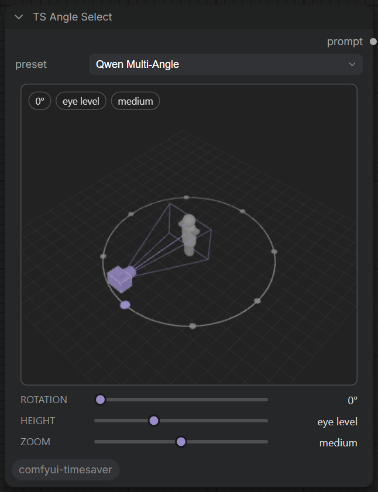

Point a camera at the subject and get the prompt that asks a model for exactly
that view. The node shows a small 3D preview — the subject, the orbit around it
and the camera on that orbit — and under it three controls: **rotation**,
**height** and **zoom**. Move a control and the preview shows where the camera
went.

The preview is only that: a preview. Setting three values by dragging one canvas
turned out to be fiddly, so each value has its own slider, and nothing in the
widget changes size with its value — the node never shifts under the cursor
while a slider is being dragged.

**The wording belongs to the model, not to the node.** With the bundled
**Qwen Multi-Angle** preset the output is the trigger phrase the
Multiple-Angles LoRA was trained on — `<sks> back view elevated shot close-up`
and nothing else. It reads like a fragment because it is one: the LoRA learned
these exact words next to the upstream node that emits them, and prettier
English breaks the conditioning. The `<sks>` token has to be there.

**Presets are plain JSON**, one file per model in `nodes/text/angle_presets`.
A preset says what template to fill and which phrase belongs to each camera
position, so supporting a new model is a new file rather than a code change. A
preset missing a phrase is skipped with a line in the log — half a vocabulary
would quietly produce a prompt with a hole in it.

**Eight rotations, four heights, three framings.** Those are the buckets the
model was trained on; there is nothing in between, because a phrase for it does
not exist.

Three.js ships with the pack and loads **only when this node appears** — it is
deliberately kept out of the web folder, because ComfyUI imports every script in
there on page load and nobody should pay for a 3D library they never use.

**Use when:** re-shooting the same subject from another angle with Qwen-Image-Edit
and the Multiple-Angles LoRA, or building a turnaround by stepping through the
eight rotations.
---

#### TS Prompt Builder
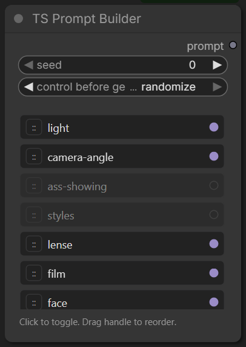

Builds a prompt out of **wildcard packs**. A pack is just a folder in
`nodes/prompts/` holding `.txt` wildcards plus a **semantic map**, and the map is the
whole point: without one, picking a random line from twenty lists gives you a winter
street in a swimsuit, a close-up with a full-body pose, and two incompatible scenes at
once.

The map says what each wildcard *is* — its role, where it belongs in the phrase, what it
excludes, what it goes well with — and the node assembles by that instead of by luck.
Eight steps, taken from the packs' own `algorithm` section: profile or your own toggles,
then the people-in-frame policy, mutual exclusions, incompatible pairs, optional
companions, an affinity pass, one line per surviving wildcard, and finally the phrase in
role order.

**Any packs combine, in any combination.** Turn several on and the roles interleave into
one sentence — all the identity first, then clothing, then the act, then place and camera
— rather than one pack's output glued onto another's. Wildcards are namespaced by pack, so
two `face.txt` never collide, and where two packs both offer a face, a light or a pose,
exactly one survives: a draw weighted by each pack's `mix.priority`, so a mix of five is a
genuine blend and not the loudest pack talking over the rest.

**The scene holds together.** Place lives in the text of the lines, not in the links
between files, so semantics alone could not stop a prompt from putting a pool, a rainstorm
and a kitchen in one sentence — measured at 22% of assemblies. The node now picks the
place first and then reads every other line against it, dropping the ones that argue about
where or when we are. Same measurement afterwards: 3%, and what is left are metaphors
rather than mistakes.

Drop a folder in by hand and press **Reload** — no ComfyUI restart. The node shows the
wildcards grouped by role, dims the ones that will collapse to a single pick at run time,
lets you pin one so it survives a collision, and previews the assembled prompt live using
the very same code the run will use. A second output reports what the semantic map threw
out and why.

`seed = 0` gives a new prompt every run; anything above 0 is reproducible.

**Use when:** running batches with controlled variation — every wildcard is a category,
every line a flavour, and the semantic map keeps the combination coherent.

---

#### TS Batch Prompt Loader
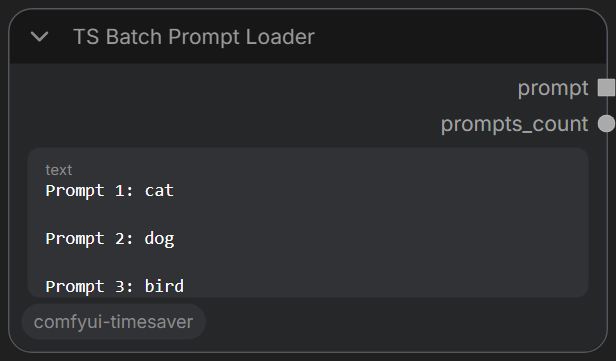

Paste a multiline text where prompts are separated by blank lines, get back a list of prompts plus a count.

```
Prompt 1: cat on a windowsill

Prompt 2: dog at the beach

Prompt 3: bird on a branch
```

**Use when:** running a batch of distinct prompts through the same workflow without manually feeding them.

---

#### TS Style Prompt Selector
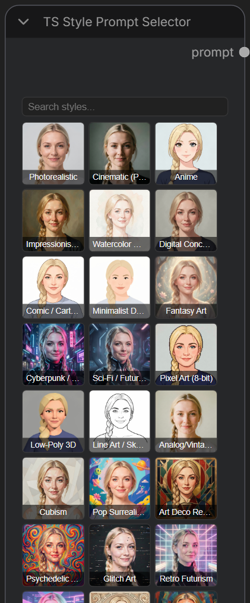

Visual style picker: a library of **157 styles** with thumbnail previews, grouped into 15 categories that run from cave painting and Byzantine mosaic through the twentieth-century avant-garde and film noir to pixel art and vaporwave. Pick one — get the matching `STRING`.

Each entry is a **pure style modifier** — medium, technique, palette and texture, with no subject of its own — and ends with a comma and a space. That is deliberate: the output is meant to be **prepended** to your own prompt (a `Concatenate` node with this node in `string_a` and your prompt in `string_b`), so the two halves read as one sentence:

```text
style   ukiyo-e woodblock print style, bold black keyblock outlines, visible paper grain,
yours   portrait of an old fisherman
result  ukiyo-e woodblock print style, bold black keyblock outlines, visible paper grain, portrait of an old fisherman
```

Names, categories and descriptions are bilingual and follow the ComfyUI interface language (English / Russian).

**Use when:** stylising a generation without rewriting the same "in the style of …" phrase, or browsing for a look you cannot name yet.

---

#### TS Silero Stress
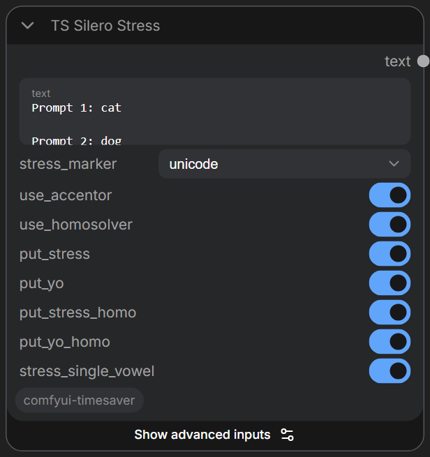

Russian-language text preprocessor: places stress marks (Unicode acute or Silero's `+` notation) and restores `ё` letters. Two algorithms (rule-based accentor + homograph disambiguation neural net) that you can independently toggle.

**Use when:** preparing Russian text for TTS to avoid mispronunciations, or generating educational materials with stress marks.

---

<a id="ideogram"></a>
### 🎨 Ideogram (1 node)

Design tools for the open-weight **Ideogram 4** image model.

#### TS Ideogram Designer
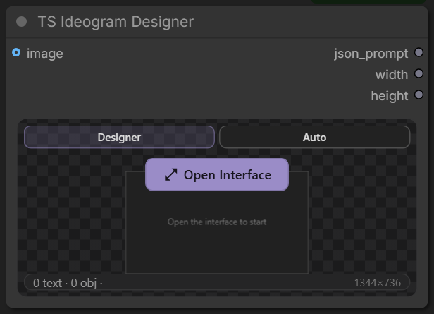

Visual JSON-prompt designer for Ideogram 4. Open a full-screen editor, drag and resize **text** and **object** blocks on an aspect-correct artboard (optionally over a reference image), and design with **two-level presets** — 10 layout templates (*what* you're making) and 10 styles (palette + fonts + look) — in a **RU/EN** interface. The node emits a valid Ideogram 4 **structured-JSON caption** as a `STRING` plus **`width` and `height`** (INT), sized from the aspect ratio and a **0.5–2 MP** slider, always rounded to multiples of 32 — wire them straight into an empty-latent / canvas node. Editor rectangles become normalized `[y_min, x_min, y_max, x_max]` bounding boxes (integers 0–1000, top-left origin) and the whole caption is assembled to the **exact Ideogram 4 schema** — verified section-by-section key order (incl. the photo-vs-non-photo `medium`/`art_style` ordering). The **in-node preview is a true WYSIWYG miniature of the editor** — real fonts, weights, colours, outlines and solid plates, with auto-fitted, word-wrapped text — so what you see after *Save* is what Ideogram is asked to draw, and the final prompt is shown with **JSON syntax highlighting**. Style each text block with a single **Text style** dropdown (fonts are *described*, not named — Ideogram has no typeface selector), a **Thin / Regular / Bold** weight and a case; **text size comes from how big you draw the block**, not an abstract picker. Add an **outline** and/or a **solid plate** for legibility — each with its own colour, rendered live on the canvas and in the preview. Colour is steered with separate palettes for the **whole image, the background and the lighting** plus per-element colours, all folded into the caption and previewed live on the artboard. **Save, export and import** individual layouts and styles — or a **full design** (the entire artboard) — as JSON (imports are copied into the node's `user_presets/` folder). The inspector is organised into clear steps — *what you're making* → *how it should look* → *what's in the scene* — and **every control has a friendly, fully-localized hover tooltip**. Edit text inline by double-clicking a block, clone with **Alt-drag** or **Ctrl+C / Ctrl+V**, and the text stays the same size in edit and preview. First-class **Russian / Cyrillic** support (UPPERCASE + bold defaults) plus a *visual-only* mode that emits a clean placeholder block so you can overlay the text by hand for print-critical work. Fluid in-node preview that works in both the LiteGraph (Nodes 1.0) and Vue (Nodes 2.0) front-ends.

**Use when:** designing YouTube thumbnails, posters and covers where you need precise control over where text and elements land — and which style Ideogram renders.

---

<a id="files"></a>
### 📁 Files & Models (2 nodes)

Tools for managing model files, downloads, EDLs, and inspecting weights.

#### TS Files Downloader
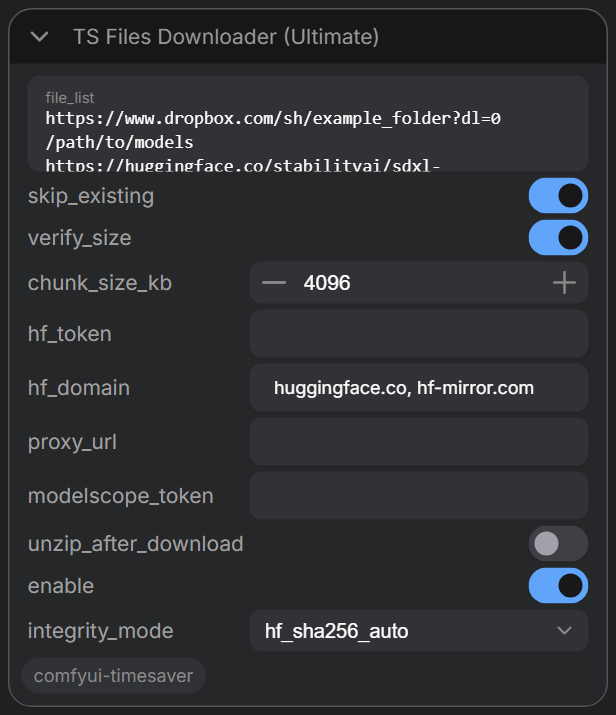

Multi-file downloader that takes a list of `URL <space> target_path` lines and downloads them sequentially. Auto-replaces HuggingFace mirrors with reachability check across the full mirror list, supports `models/<subdir>` aliases, resumes interrupted downloads, validates archives against zip-slip on auto-unzip, and shows progress (including SHA256 verification). Handy for one-shot pulling all assets a workflow needs.

**Get models from workflow.** The button on the node fills that list for you: it walks the open graph — **including inside subgraphs**, where template loaders normally live — and collects every model it needs. It reads the `{name, url, directory}` metadata ComfyUI stamps onto each loader, cross-checks it against the workflow's Markdown note, and falls back to the loader's own filename when neither carries a link. You get a report first; **Append** adds only what is missing and never rewrites lines you wrote by hand, **Replace list** starts over.

Models you already have are listed too, on purpose: the list travels with the workflow, so whoever you send it to still needs those lines.

**Which loaders it understands is asked of your ComfyUI, not written down here.** Every loader's dropdown is filled from a `models/` folder, so the options themselves say which folder they came from — the node reads that from the running server and maps each widget of each installed node to its folder. That is why a model in `Load Latent Upscale Model`, or in a node from a pack installed yesterday, is found the same as a checkpoint. A written-down table could not do it: on the maintainer's machine 49 installed node types own a model widget such a table never heard of, two of them from ComfyUI itself. One node with two model widgets from different folders keeps them apart — a text encoder and a checkpoint on the same loader go to their own places.

The folder it proposes is the one your models of that category are **already in**. ComfyUI reads two directories per category — `clip` and `text_encoders`, `unet` and `diffusion_models` — and both are real; if your encoders live in `clip`, that is where the download is aimed, not at the empty folder next to it. A line you wrote in the list yourself is never rewritten.

**Cancelling the run stops everything.** ComfyUI's cancel button ends the file in flight *and* every file still queued after it. A partial file is kept as `.part`, so the next run resumes from where it stopped instead of starting over. Progress is one bar for the whole list, from the first model to the last.

**The rest of the workflow waits.** This node brings in the models the graph has nothing to load without, so it holds the run until the last file has landed rather than handing the graph back while the bytes are still arriving.

**Use when:** distributing a workflow that needs N specific models — open it, press the button, and the node is filled in.

> **Network behaviour (for security review):** the node issues standard HTTPS `HEAD`/`GET` requests **only** to the URLs you type into `file_list`, identifying itself with an honest `comfyui-timesaver/<version>` User-Agent. It does **not** execute, import, or run anything it downloads — files are written to disk only. There are no hardcoded callback/telemetry endpoints. Optional `hf_token` / `modelscope_token` are sent as an `Authorization` header **only** to their matching host (HuggingFace / ModelScope respectively) and are never logged or forwarded elsewhere. Auto-unzip is validated against zip-slip path traversal before extraction.

---

#### TS YouTube Chapters
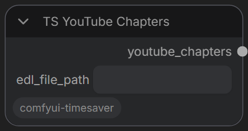

Convert a DaVinci Resolve EDL (Edit Decision List) export into a YouTube-friendly chapter list. Reads marker timecodes, normalises to a 1-hour baseline, formats as `MM:SS Marker Name`.

**Use when:** publishing tutorial videos and you've already marked chapters in your editor.

---

<a id="utils"></a>
### 🛠️ Utils (6 nodes)

Tiny helpers that make the graph less cluttered.

#### TS Group Bypasser
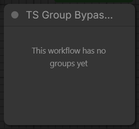

A control panel for the groups of the open workflow. The node's body holds nothing but group names and checkboxes: unchecking one puts **every node inside that group into bypass**. Double-click a row to show that group on the canvas. The node sizes itself to the number of groups — two groups give a two-row node, with no empty space underneath.

The state is not kept in this node — it is read back from the graph, so a node muted by hand, or one that belongs to two overlapping groups, honestly reads as "partly on" instead of being passed off as something definite.

**The settings live in the node's Properties Panel** (right-click the node): filter by title (a substring, or `/…/` for a regular expression), filter by colour (comma-separated; LiteGraph colour names, hex, and `none` for uncoloured groups all work), the order of the list (by position, title or colour), and a "max one" / "always one" rule for when switching one group on should switch the others off — handy for A/B branches. **Bulk actions** (enable, bypass or invert everything shown) are in the node's right-click menu.

Bypassed groups survive a save without any help from this node: the state lives in the modes of the nodes themselves.

**Use when:** a heavy workflow with several branches and only one of them wanted per run.
**On the canvas, every group also gets its own badge** — a small square in the group's top-right corner (the same idea rgthree-comfy popularised). One click sends the whole group into bypass, another brings it back; empty groups get no badge, because there is nothing there to switch. It works with classic nodes and with Nodes 2.0, and needs no node on the graph at all — turn it off in **Settings → TS Timesaver → Canvas → "Bypass button on group headers"** if you'd rather not have it.


---

#### Tidy up — one command, no node

Right-click on the canvas (or on any node) → **Tidy up** → **Tidy layout**. Whatever is selected — or the whole graph, when nothing is — gets arranged: every node shrinks to the size its own content asks for, and the lot is laid out in columns that follow the wiring, left to right, snapped to the grid. Both entries are in the command palette too, so you can bind keys to them.

The column a node lands in is its distance from the start of the flow, so a loader is always left of the sampler that reads it, and a node with one input lines up with what feeds it. Inside a column the order is chosen to keep the links from crossing, starting from the order you already had — the command tidies your arrangement rather than replacing it with someone else's. The whole thing stays where the schema was: the top-left corner does not move, so you are not left hunting for your graph afterwards.

**Groups are laid out from the inside out.** The nodes of a group are arranged within it, the frame is then fitted to them, and the group takes part in the outer layout as a single block — an organised workflow stays organised. **Pinned nodes are never moved**: pinning is how you say "this one stays", and the command respects it.

**Wires that cut through nodes can be routed around them.** The second entry, **Tidy layout + route the wires**, lays the graph out and then, for every wire whose straight line would cross somebody else's node, drops link dots that take it into the corridor between columns, along a free lane, and back — one lane for the whole detour, and any dot that earns nothing is dropped again. Wires that already have dots are left to their owner, and wires running against the flow are left alone. Run it twice and nothing changes.

Each wire is routed knowing about the ones already routed, and the lane it takes is chosen by what it costs: **lying on top of another wire is all but forbidden** — two lines reading as one is what makes a schema unreadable, and you cannot even tell how many wires are there. Crossing costs far less, a longer detour least of all. That is a deliberate trade: a crossing is visible and understandable, an overlap is not. Wires leaving the same socket get no exemption either. A wire is rerouted not only when it cuts a node but also when it comes to rest on another wire, and the whole set is then routed a second time, each wire lifted and laid again now that it knows where all the others ended up.

Measured on a real 32-node workflow: the layout alone left 68 places where a wire runs through a node and 94 wire crossings; routing brings that to **0 cuts, 0 overlaps and 88 crossings**. The same graph as its author had arranged it by hand: 40 cuts, 84 crossings. The crossings that remain come from the order of the nodes in their columns rather than from the wires — laying out and routing together, so that the order is chosen with the wires in mind, is the next step and is not done yet.

**Or pack it as tiles.** The third entry, **Pack as tiles**, is the other request: not "show me the flow" but "get rid of the empty space". Every node in a column is given the same width, so they read as tiles rather than a ragged staircase, and a column now holds **several consecutive layers of the graph** rather than one — a column per layer turns a workflow into a ribbon nobody's monitor can show. The height of the columns is chosen so the whole thing lands near **16:9**, and so that no column ends up noticeably emptier than its neighbours. Nodes of the same type stay together, and each column is ordered by how soon a node's result is needed — so the node the flow actually starts from is top-left, and the last one is bottom-right. (Barycentres alone could not do that: a loader whose output is only needed at the very end has no opinion about the column next to it, and used to float to the top.) **The wires are not touched at all** in this mode: no aligning, no routing.

Measured on a real 32-node workflow: 17 columns and 5540×1308 become **5 columns and 1760×1128** — the area actually filled by nodes goes from 17% to 76%, and the shape from 4.2:1 to 1.6:1, which fits on a screen.

**The dots on your links are straightened too.** ComfyUI's link reroutes — the small round points you drop onto a wire — are spread evenly along the straight line between the socket they leave and the socket they enter, so a wire that ran as a dogleg through a point you tossed somewhere becomes a straight run. A point shared by several links settles between them. A wire whose straight line would cross a node is left bent — a detour that exists for a reason is not undone. Nothing is created and nothing is deleted: the graph you get back is the one you had. **Align link dots only** is the second entry in the submenu, for when the nodes are already where you want them.

Works in both node renderers. That is not a given: measured on the same graph, Nodes 2.0 gives a node a different size than Nodes 1.0 (`SaveImage` 58 px against 70) and refuses to shrink some nodes at all while `node.size` claims otherwise — so the command asks the canvas what it actually drew before deciding where anything goes.

---

#### TS LoRA Loader
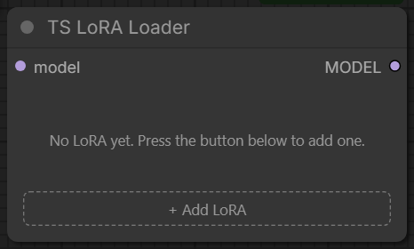

A stack of model-only LoRAs in one node. The plus button opens a search box over the LoRAs this install actually has; a chosen one drops in as a row with its own strength field, and the plus stays where it is for the next one. Rows are reordered by dragging the grip — order matters, because LoRAs are applied one after another.

**Each row has a switch.** Turn a LoRA off and it stays in the list with its strength and its place; the run simply goes without it, and one click brings it back. That is what an A/B comparison should cost — nothing. Clicking the row's name does the same thing, for whoever finds that quicker.

**Strength may be negative** (down to −10): that is how you damp a LoRA baked into the checkpoint, or run one in reverse. Dragging left and right over the strength field scrubs the value.

**A LoRA you just dropped into `models/loras` appears on `R`** — the same key that refreshes the native loaders. The search here is drawn by hand rather than by a stock dropdown, and until now that meant the refresh went past it: a new file stayed invisible until the page was reloaded.

The node does not load anything itself — it expands into a chain of **native `LoraLoaderModelOnly` nodes**. Two consequences, and they are the whole point: the result is identical to a hand-built chain, and ComfyUI caches each link separately, so changing the last LoRA's strength does not recompute the ones before it. A LoRA missing on this machine costs its own row and not the run, which matters for workflows that arrive from someone else.

Model only, no CLIP — modern families keep the text encoder separate, and most LoRAs in circulation are model-side anyway.

**Use when:** more than one LoRA, or any time you expect to be reordering them.

---

#### TS Int Slider
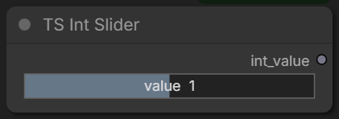

A pure integer slider that returns an `INT`. Custom-widget UI optimised for resolution / count knobs.

---

#### TS Float Slider
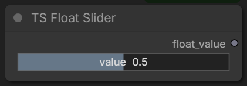

The float counterpart, range −1e9 to +1e9 with 0.01 precision by default.

**Use the pair when:** you need a clean parameter widget without dragging a full math node onto the graph.

---

#### TS Math Int
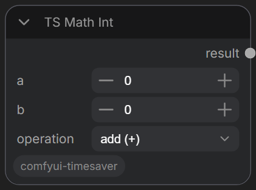

Two-input integer math: `+`, `-`, `*`, `/`, `//`, `%`, `**`, `min`, `max`. Division by zero returns 0 (logged as an error) instead of crashing the graph.

**Use when:** computing tile counts, frame indices, batch sizes, or any other piece of integer arithmetic that's awkward to express through Primitive nodes.

---

#### TS Smart Switch
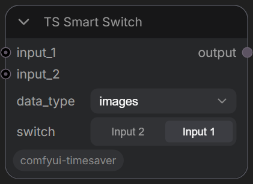

Type-aware boolean switch between two `ANY` inputs. Pick a `data_type` (images / video / audio / mask / string / int / float) so the node validates that the inputs match it. **Auto-failover**: if the selected input is missing, falls back to the other one — great for optional branches.

**Use when:** branching a workflow on a flag, or making one input optional with a sensible fallback.

---

<a id="conditioning"></a>
### 🎨 Conditioning (1 node)

#### TS Multi Reference
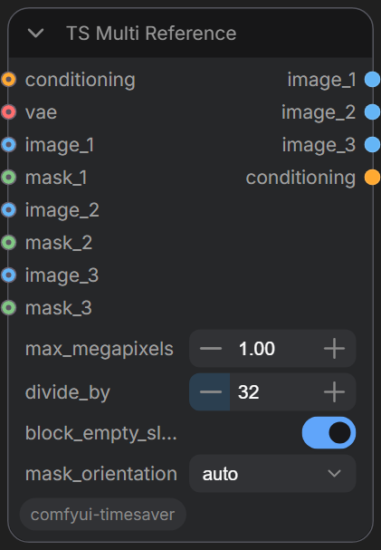

Add up to three reference images as `reference_latents` into the conditioning stream. Built for Qwen-Image-Edit and similar multi-reference pipelines. Per-slot output (`image_1` / `image_2` / `image_3`) with `ExecutionBlocker` for unconnected slots, automatic resize to a megapixel budget aligned to a divisor (default 32). Handles RGBA + MASK inputs (composites onto white).

**Use when:** running Qwen-Edit / Flux-with-references style pipelines that accept multiple reference images.

---

## 🔰 Tips for Beginners

### Just starting out?

1. **Search by category** in the right-click menu: every node lives under `TS/<Category>`.
2. **Trust defaults**: every input has a sensible default. Change one parameter at a time to learn what it does.
3. **Use [TS Resolution Selector](#image)** as your latent-image source — it always returns a sampler-friendly size.
4. **Drop a [TS Animation Preview](#video) at the end** of any video graph to QA without re-running.
5. **Need a quick voice prompt?** [TS Super Prompt](#llm) — click the mic, describe your idea, get a polished prompt.

### My VRAM is tight, what should I use?

| Need | Try |
|---|---|
| Upscale a 4K image | TS Image Tile Splitter → upscaler → TS Image Tile Merger |
| Process only the face/object | TS Crop To Mask → upscaler/restorer → TS Restore From Crop |
| FP8 a model | TS Model Converter Advanced |

### Where do model files live?

| Node | Default folder |
|---|---|
| TS Lama Cleanup | `models/lama/` |
| TS Whisper | `models/whisper/` |
| TS Silero TTS | `models/silerotts/` |
| TS Silero Stress | `models/silero-stress/` |
| TS Qwen 3 VL | `models/LLM/` |
| TS Super Prompt | `models/LLM/` |
| TS Music Stems | `models/roformer/`; demucs default cache for the legacy engine |

You can override these with `extra_model_paths.yaml` — Timesaver respects ComfyUI's path resolution.

---

## 🛟 Troubleshooting

<details>
<summary><b>The pack used to print a big table at startup — where did it go?</b></summary>

On a clean load the pack now says one line and nothing else:

```
[TS Timesaver] All 73 nodes loaded successfully.
```

The ComfyUI console is shared by every pack you have installed, and two screens
of tables on each launch buried real errors — including ours. Anything that does
go wrong is still printed, and only that.

The full report (module table, external-import table, totals) is one variable
away:

```bash
TS_VERBOSE_STARTUP=1
```

Set it before starting ComfyUI (on Windows: `set TS_VERBOSE_STARTUP=1` in the
same console, or add it to your `.bat`). Useful when a node is missing and you
want to see exactly which module refused to load and why.

</details>

<details>
<summary><b>"ffmpeg not found" or audio and video nodes failing to decode</b></summary>

You should not have to install ffmpeg at all: `imageio-ffmpeg` is a required
dependency and ships a static binary for every platform the pack runs on. The
audio loader, TS Whisper, the Super Prompt voice input and TS Animation Preview
all ask for that binary first and only then look at your PATH.

So this message means the dependency itself is missing or its binary was cleaned
away. Fix it with the Python ComfyUI runs from:

```bash
python -m pip install --upgrade imageio-ffmpeg
```
</details>

<details>
<summary><b>"A required media input has no file selected" after a reload</b></summary>

This one is ComfyUI's own bug, and the pack fixes it — the only place it touches
core at all.

Paste an image into a node with Ctrl+V, or drop one onto it, and ComfyUI stores
the file in `input/pasted/` while the widget keeps the value `pasted/name.png`.
Everything works until you reload. After a reload the list of available files
comes from the server, and the stock `Load Image` lists only what sits directly
in `input` — it never looks into subfolders. The editor cannot find the saved
value in that list and calls the file missing, though it has been on disk the
whole time.

Timesaver widens the list for the stock `Load Image` and `Load Image (as Mask)`
so they see images in every `input` subfolder. No node is replaced, no file is
moved, and already-saved workflows start opening on their own. Dot-folders
(packs' working caches) stay out of the list.

To switch it off: set `TS_DISABLE_PASTED_MEDIA_FIX=1` before starting ComfyUI.
</details>

<details>
<summary><b>"Module not found" on startup</b></summary>

Check the startup log — Timesaver prints a load report. Missing optional dependencies appear under **Optional missing imports** with the file that needs them. Install with:

```bash
python -m pip install <missing_module>
```

Use the same Python ComfyUI runs from. On Windows portable: `python_embeded\python.exe -m pip install <module>`.
</details>

<details>
<summary><b>A node doesn't appear in the menu</b></summary>

Look at the startup log for **Module load issues**. The most common cause is a missing optional dependency — e.g. `py360convert` is required for the cube/equirect nodes. Install it and restart.
</details>

<details>
<summary><b>Workflow fails after updating</b></summary>

Timesaver freezes node ids and inputs across versions on purpose. If something breaks after `git pull`:
1. Check `doc/migration.md` for breaking changes.
2. Make sure `pip install -r requirements.txt` was run.
3. Restart ComfyUI fully — not just refresh the browser tab.
</details>

<details>
<summary><b>OOM (out of memory) errors</b></summary>

- Reduce `process_resolution` (BiRefNet) or `compute_max_side` (Color Match).
- For upscaling, use `TS Image Tile Splitter` + tiled processing.
- For LLM, drop precision to int8 or int4 (`TS Qwen 3 VL V3` → `precision=int8`).
- Use `unload_after_generation=True` to free model VRAM after each run.
</details>

---

### Quiet console on Windows

ComfyUI on Windows fills its console with this, in bursts of three to six a second whenever a websocket closes — after a job, on every page reload:

```
[ERROR] Exception in callback _ProactorBasePipeTransport._call_connection_lost(None)
ConnectionResetError: [WinError 10054] An existing connection was forcibly closed by the remote host
```

Measured on a live install: 402 of 1865 log lines — 22% of everything the console said. It is a CPython bug, not a ComfyUI one: `asyncio/proactor_events.py` calls `self._sock.shutdown(...)` inside a `finally` with nothing to catch a socket the client already dropped. [python/cpython#83191](https://github.com/python/cpython/issues/83191) has been open since 2020, and updating Python does not help — the code is still unguarded in `main`.

**It is also not only noise.** The exception escapes *before* `self._sock.close()`, so the socket stays open until the garbage collector gets to it.

The pack wraps that one method and finishes the cleanup the exception interrupted — for six socket-teardown error codes and nothing else. An unexpected code is re-raised on purpose: the same method also runs your protocol's `connection_lost`, and swallowing that would hide real failures. Measured over eight page reloads and two jobs: **9 tracebacks before, 0 after**. Turn it off with `TS_DISABLE_PROACTOR_GUARD=1`.

What the pack does **not** do is switch the event loop to `WindowsSelectorEventLoopPolicy`, which is the advice in most search results: that loop cannot run subprocesses on Windows and caps out at 512 sockets. Silence is not worth real breakage.

---

## 🗂️ Repo Layout

```text
comfyui-timesaver/
├─ ts_pasted_media_fix.py  # the pack's one patch to ComfyUI itself
├─ nodes/                  # 77 modules: 73 nodes + 4 that register none
│                          #   (sampler + scheduler injectors, shared routes,
│                          #    one backward-compat re-export shim)
├─ js/                     # frontend extensions for DOM-widget nodes
├─ doc/screenshots/        # node screenshots (this README uses them)
├─ requirements.txt        # runtime dependencies
└─ pyproject.toml          # version + ComfyRegistry metadata
```

---

## 📜 License & Credits

Licensed under the terms in [LICENSE.txt](LICENSE.txt).

**Built on top of:**
- [ComfyUI](https://github.com/comfyanonymous/ComfyUI) — the graph engine and V3 API.
- [BiRefNet](https://github.com/zhengpeng7/BiRefNet) — background removal.
- [LaMa](https://github.com/advimman/lama) — image inpainting.
- [Whisper](https://github.com/openai/whisper) — speech recognition.
- [Demucs](https://github.com/facebookresearch/demucs) — music source separation.
- [Silero](https://github.com/snakers4/silero-models) — Russian TTS / stress.
- [Qwen](https://github.com/QwenLM/Qwen3-VL) — vision-language model.
- [Spandrel](https://github.com/chaiNNer-org/spandrel) — model loading for upscalers.
- [py360convert](https://github.com/sunset1995/py360convert) — 360° conversions.
- [RIFE](https://github.com/megvii-research/ECCV2022-RIFE) / [FILM](https://github.com/google-research/frame-interpolation) — frame interpolation.

**Maintainer:** [@AlexYez](https://github.com/AlexYez)

**Issues / feature requests:** https://github.com/AlexYez/comfyui-timesaver/issues

---

<div align="center">

**Found this useful?** ⭐ Star the repo to help others find it.

</div>
