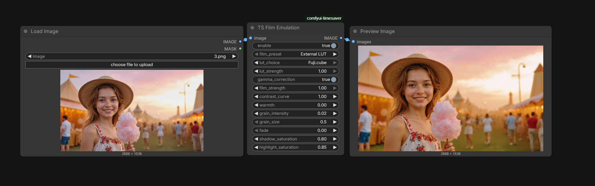

# ComfyUI Timesaver Nodes

[English](README.md) | [Русский](README.ru.md)

Подробный, основанный на коде справочник по нодам, для которых есть скриншоты в `docs/img`. В каждом разделе описаны назначение, входы, выходы и поведение ноды.

Репозиторий: https://github.com/AlexYez/comfyui-timesaver

## Установка

1. Клонируйте репозиторий или скачайте файлы.
2. Скопируйте папку в `ComfyUI/custom_nodes/comfyui-timesaver`.
3. Перезапустите ComfyUI.

## Ноды со скриншотами

- [TS Files Downloader (Ultimate)](#ts-files-downloader-ultimate)
- [TS Film Emulation](#ts-film-emulation)
- [TS Image Resize](#ts-image-resize)
- [TS Qwen 3 VL](#ts-qwen-3-vl)
- [TS Style Prompt Selector](#ts-style-prompt-selector)
- [TS Video Depth](#ts-video-depth)
- [TS Whisper](#ts-whisper)
- [TS YouTube Chapters](#ts-youtube-chapters)

## TS Files Downloader (Ultimate)


Массовая загрузка файлов с поддержкой возобновления, зеркал, прокси и авто-распаковки. Это output-нода, которая пишет файлы на диск.

**Информация о ноде**
- Internal id: `TS Files Downloader`
- Category: `Tools/TS_IO`
- Function: `execute_downloads`
- Output node: да (только побочные эффекты)

**Обязательные входы**

| Имя | Тип | По умолчанию | Описание |
| --- | --- | --- | --- |
| file_list | STRING (multiline) | Пример (см. ниже) | Одна строка = `URL /target/dir`. Строки, начинающиеся с `#`, игнорируются. |
| skip_existing | BOOLEAN | `True` | Пропускает загрузку, если файл уже существует; при `verify_size` размер должен совпасть. |
| verify_size | BOOLEAN | `True` | Проверяет размер файла по `Content-Length`, если он доступен. |
| chunk_size_kb | INT | `4096` | Размер чанка в KB (4096 = 4 MB). |

**Опциональные входы**

| Имя | Тип | По умолчанию | Описание |
| --- | --- | --- | --- |
| hf_token | STRING | `""` | Токен Hugging Face (обычно начинается с `hf_`). |
| hf_domain | STRING | `huggingface.co, hf-mirror.com` | Список зеркал HF через запятую. |
| proxy_url | STRING | `""` | Proxy URL, например `http://127.0.0.1:7890`. |
| modelscope_token | STRING | `""` | Токен доступа ModelScope. |
| unzip_after_download | BOOLEAN | `False` | Автораспаковка `.zip` в целевую папку и удаление архива. |
| enable | BOOLEAN | `True` | Отключает ноду (загрузки не выполняются). |

**Выходы**
- Нет. Нода выполняет загрузки как побочный эффект.

**Пример file_list**

```
https://www.dropbox.com/sh/example_folder?dl=0 /path/to/models
https://huggingface.co/stabilityai/sdxl-turbo/resolve/main/sd_xl_turbo_1.0_fp16.safetensors /path/to/checkpoints
```

**Особенности поведения**
- Проверка доступности идет по доменам из `file_list`; если ничего не доступно, нода завершает работу.
- Выбор зеркала HF делается по первому доступному значению из `hf_domain`.
- Возобновление загрузки использует `.part` файлы и HTTP range, если сервер поддерживает.
- Ссылки Dropbox переводятся в режим прямой загрузки.
- Имя файла берется из `Content-Disposition`, если заголовок есть; иначе из URL.

## TS Film Emulation



Эмуляция пленки с пресетами и внешними LUT `.cube`, плюс контраст, теплота, fade и зерно.

**Информация о ноде**
- Internal id: `TS_Film_Emulation`
- Category: `Image/Color`
- Function: `process`

**Обязательные входы**

| Имя | Тип | По умолчанию | Описание |
| --- | --- | --- | --- |
| image | IMAGE | — | Входное изображение. |
| enable | BOOLEAN | `True` | Включает или отключает эффект целиком. |
| film_preset | LIST | `External LUT` (первый вариант) | Варианты: External LUT, Kodak Vision3 250D, Kodak Portra 400, Fuji Eterna 250T, Agfa Vista 200, Ilford HP5, Kodak Gold 200, Fuji Superia 400. |
| lut_choice | LIST | `None` (первый вариант) | Сканируется из `luts/`: `None` + файлы `.cube`. |
| lut_strength | FLOAT | `1.0` | Сила смешивания LUT. |
| gamma_correction | BOOLEAN | `True` | Преобразование sRGB to linear и обратно при применении LUT. |
| film_strength | FLOAT | `1.0` | Сила смешивания пленочного пресета. |
| contrast_curve | FLOAT | `1.0` | Контрастная кривая вокруг средних тонов. |
| warmth | FLOAT | `0.0` | Теплота (красный вверх, синий вниз). |
| grain_intensity | FLOAT | `0.02` | Интенсивность зерна. |
| grain_size | FLOAT | `0.5` | Размер зерна (больше = крупнее). |
| fade | FLOAT | `0.0` | Поднятие к среднему серому для faded-эффекта. |
| shadow_saturation | FLOAT | `0.8` | Сатурация в тенях. |
| highlight_saturation | FLOAT | `0.85` | Сатурация в светах. |

**Выходы**
- IMAGE: обработанное изображение.

**Особенности поведения**
- Если `enable` выключен, изображение возвращается без изменений.
- Пленочные пресеты смешиваются с оригиналом через `film_strength`.
- Контраст, теплота, fade и сатурация теней/светов применяются до LUT.
- Внешние LUT берутся из `luts/<lut_choice>` и могут использовать gamma correction.
- Зерно добавляется после цветовых операций; `grain_size` задает масштаб шума.

## TS Image Resize


Гибкий ресайз: явный размер, по стороне, scale factor или мегапиксели, с поддержкой маски.

**Информация о ноде**
- Internal id: `TS_ImageResize`
- Category: `image`
- Function: `resize`

**Обязательные входы**

| Имя | Тип | По умолчанию | Описание |
| --- | --- | --- | --- |
| pixels | IMAGE | — | Входное изображение. |
| target_width | INT | `0` | Целевая ширина (0 = игнорировать). |
| target_height | INT | `0` | Целевая высота (0 = игнорировать). |
| smaller_side | INT | `0` | Размер меньшей стороны (0 = игнорировать). |
| larger_side | INT | `0` | Размер большей стороны (0 = игнорировать). |
| scale_factor | FLOAT | `0.0` | Множитель масштаба (0 = игнорировать). |
| keep_proportion | BOOLEAN | `True` | Сохранять пропорции при таргет-режимах. |
| upscale_method | LIST | `bicubic` | Варианты: nearest-exact, bilinear, bicubic, area, lanczos. |
| divisible_by | INT | `1` | Округление конечного размера до кратности. |
| megapixels | FLOAT | `1.0` | Цель в мегапикселях (используется, если другие режимы не заданы). |
| dont_enlarge | BOOLEAN | `False` | Запрещает апскейл сверх исходного размера. |

**Опциональные входы**

| Имя | Тип | По умолчанию | Описание |
| --- | --- | --- | --- |
| mask | MASK | — | Маска, которая ресайзится вместе с изображением. |

**Выходы**

| Имя | Тип | Описание |
| --- | --- | --- |
| IMAGE | IMAGE | Ресайз-изображение. |
| width | INT | Финальная ширина. |
| height | INT | Финальная высота. |
| MASK | MASK | Ресайз-маска (если была), иначе исходная. |

**Особенности поведения**
- Приоритет режимов: `scale_factor` -> `target_width/target_height` -> `smaller_side/larger_side` -> `megapixels`.
- При `keep_proportion` и заданных обеих сторонах используется режим cover + центр-кроп.
- При `keep_proportion` = False и заданных обеих сторонах используется растяжение до точного размера.
- `divisible_by` применяется только в пропорциональных режимах.
- Маска ресайзится методом `nearest-exact` для сохранения границ.

## TS Qwen 3 VL


Vision-language нода для Qwen 3 VL с пресетами, кешированием, offline-режимом и поддержкой изображений и видео.

**Информация о ноде**
- Internal id: `TS_Qwen3_VL`
- Category: `LLM/TS_Qwen`
- Function: `process`

**Обязательные входы**

| Имя | Тип | По умолчанию | Описание |
| --- | --- | --- | --- |
| model_name | STRING | `hfmaster/Qwen3-VL-2B` | ID модели на Hugging Face. |
| system_preset | LIST | Первый пресет или `Your instruction` | Пресеты из `qwen_3_vl_presets.json` плюс `Your instruction`. |
| prompt | STRING (multiline) | `""` | Текст запроса пользователя. |
| seed | INT | `42` | Сид генерации. |
| max_new_tokens | INT | `512` | Максимум токенов генерации. |
| precision | LIST | `fp16` | Варианты: fp16, bf16, fp32; int8/int4 появляются при наличии bitsandbytes. |
| use_flash_attention_2 | BOOLEAN | `True` при наличии | Включает Flash Attention 2, если библиотека доступна. |
| offline_mode | BOOLEAN | `False` | Использовать только локальную модель. |
| unload_after_generation | BOOLEAN | `False` | Выгрузить модель из кеша после генерации. |
| enable | BOOLEAN | `True` | Отключает инференс. |
| hf_token | STRING | `""` | Токен Hugging Face для приватных репозиториев. |
| max_image_size | INT | `1024` | Максимальная сторона перед ресайзом и центр-кропом. |
| video_max_frames | INT | `48` | Максимальное число кадров видео. |

**Опциональные входы**

| Имя | Тип | По умолчанию | Описание |
| --- | --- | --- | --- |
| image | IMAGE | — | Опциональное изображение. |
| video | IMAGE | — | Опциональные кадры видео (последовательность IMAGE). |
| custom_system_prompt | STRING (multiline) | — | Используется только при `system_preset` = `Your instruction`. |
| hf_endpoint | STRING | `huggingface.co, hf-mirror.com` | Список зеркал через запятую. |
| proxy | STRING | `""` | HTTP/HTTPS прокси для загрузок. |

**Выходы**

| Имя | Тип | Описание |
| --- | --- | --- |
| generated_text | STRING | Текст модели (или строка ошибки). |
| processed_image | IMAGE | Изображения/кадры после ресайза и кропа, использованные моделью. |

**Особенности поведения**
- Модели кешируются глобально и хранятся в `models/LLM/<repo_name>`.
- `offline_mode` требует полностью локальную модель (config + weights), иначе будет ошибка.
- Изображения уменьшаются до `max_image_size` и центр-кропятся до кратности 32.
- Видео равномерно семплируется до `video_max_frames` кадров.
- При `enable` = False нода возвращает prompt и обработанные изображения без инференса.

## TS Style Prompt Selector


Выбирает текст промпта из `styles/styles.json` по id или name.

**Информация о ноде**
- Internal id: `TS_StylePromptSelector`
- Category: `TS/Prompt`
- Function: `get_prompt`

**Обязательные входы**

| Имя | Тип | По умолчанию | Описание |
| --- | --- | --- | --- |
| style_id | STRING | `photorealistic` | id или name стиля из `styles/styles.json`. |

**Выходы**

| Имя | Тип | Описание |
| --- | --- | --- |
| prompt | STRING | Текст промпта выбранного стиля. |

**Особенности поведения**
- Стили загружаются из `styles/styles.json` (ожидается список `styles`).
- Совпадение идет по полям `id` или `name`.
- Если стиль не найден, возвращается один пробел.
- Пак также публикует эндпоинты `/ts_styles` и `/ts_styles/preview` для UI.

## TS Video Depth


Генерирует карты глубины для видео через VideoDepthAnything с опциональной окраской, дезеринговой шумовой добавкой и blur.

**Информация о ноде**
- Internal id: `TS_VideoDepthNode`
- Category: `Tools/Video`
- Function: `execute_process_unified`

**Обязательные входы**

| Имя | Тип | По умолчанию | Описание |
| --- | --- | --- | --- |
| images | IMAGE | — | Входные кадры (последовательность IMAGE). |
| model_filename | LIST | `video_depth_anything_vitl.pth` | Вес модели: vits (small) или vitl (large). |
| input_size | INT | `518` | Размер для инференса (авто-кратность 14). |
| max_res | INT | `1280` | Если > 0, уменьшает кадры с большой стороной больше этого значения. |
| precision | LIST | `fp16` | Точность инференса (fp16 или fp32). |
| colormap | LIST | `gray` | gray, inferno, viridis, plasma, magma, cividis. |
| dithering_strength | FLOAT | `0.005` | Добавляет слабый шум перед окраской. |
| apply_median_blur | BOOLEAN | `True` | Применяет median blur к карте глубины. |
| upscale_algorithm | LIST | `Lanczos4` | Апскейл: Lanczos4, Cubic или Linear. |

**Выходы**
- IMAGE: последовательность RGB карт глубины.

**Особенности поведения**
- Если весов нет, они скачиваются в `models/videodepthanything`.
- `input_size` приводится к кратности 14 при необходимости.
- `max_res` снижает нагрузку на память за счет уменьшения кадра перед инференсом.
- Глубина нормализуется и окрашивается выбранной палитрой с опциональным шумом и blur.
- Результат апскейлится обратно до исходного разрешения через `upscale_algorithm`.

## TS Whisper


Транскрибация или перевод аудио через Whisper Large v3 с выводом SRT и plain text.

**Информация о ноде**
- Internal id: `TSWhisper`
- Category: `AudioTranscription/TSNodes`
- Function: `generate_srt_and_text`

**Обязательные входы**

| Имя | Тип | По умолчанию | Описание |
| --- | --- | --- | --- |
| audio | AUDIO | — | Входное аудио (waveform + sample_rate). |
| output_filename_prefix | STRING | `transcribed_audio` | Префикс имени для сохранения SRT. |
| task | LIST | `transcribe` | transcribe или translate_to_english. |
| source_language | LIST | `auto` | auto, en, ru, fr, de, es, it, ja, ko, zh, uk, pl. |
| save_srt_file | BOOLEAN | `True` | Сохранять SRT на диск. |
| precision | LIST | `fp16` при наличии | fp32, fp16 и bf16 (если CUDA bf16 доступен). |
| attn_implementation | LIST | `sdpa` при наличии | eager или sdpa (если PyTorch SDPA доступен). |
| plain_text_format | LIST | `single_block` | single_block или newline_per_segment. |
| manual_chunk_length_s | FLOAT | `28.0` | Длина чанка в секундах (<= 30). |
| manual_chunk_overlap_s | FLOAT | `4.0` | Перекрытие между чанками в секундах. |

**Опциональные входы**

| Имя | Тип | По умолчанию | Описание |
| --- | --- | --- | --- |
| output_dir | STRING | Директория вывода ComfyUI | Базовый путь для SRT. |

**Выходы**

| Имя | Тип | Описание |
| --- | --- | --- |
| srt_content_string | STRING | Полный SRT текст. |
| plain_text_string | STRING | Транскрипт в plain text. |

**Особенности поведения**
- Используется `openai/whisper-large-v3` с кешированием в `models/whisper`.
- Аудио ресемплируется до 16 kHz.
- Для длинных файлов применяется ручной чанкинг с перекрытием.
- При `save_srt_file` = True файлы пишутся в `<output_dir>/subtitles/<prefix>_YYYYMMDD_HHMMSS.srt`.
- Формат текста зависит от `plain_text_format`.

## TS YouTube Chapters


Конвертирует EDL файл в таймкоды глав YouTube.

**Информация о ноде**
- Internal id: `TS Youtube Chapters`
- Category: `Tools/TS_Video`
- Function: `convert_edl_to_youtube_chapters`

**Обязательные входы**

| Имя | Тип | По умолчанию | Описание |
| --- | --- | --- | --- |
| edl_file_path | STRING | `""` | Путь к EDL файлу. |

**Выходы**

| Имя | Тип | Описание |
| --- | --- | --- |
| youtube_chapters | STRING | Список глав, одна строка на главу. |

**Особенности поведения**
- EDL читается в UTF-8 и ожидает стандартные строки таймкодов.
- Название главы берется из следующей строки по полю `|M:...|`.
- Используется стандартный оффсет начала EDL `01:00:00:00`.
- Формат времени: `mm:ss Title` или `hh:mm:ss Title` при длительности больше часа.
