<div align="center">

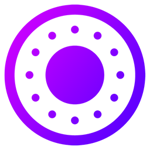

# 🚀 Timesaver Nodes для ComfyUI

**Дружелюбный набор из 59 нод, чтобы убрать рутину из ваших ComfyUI-графов.**

Ресайз, цветокоррекция, кеинг, инпейнтинг, транскрипция, переводы, конструкторы промптов, менеджмент моделей — всё прямо на канвасе.

[](pyproject.toml)
[](https://github.com/comfyanonymous/ComfyUI)
[](https://www.python.org/)
[](LICENSE.txt)

🇬🇧 [README in English](README.md)

</div>

---

## ✨ Что Внутри

Не важно, что вы строите — пайплайн для генерации изображений, видео, аудио или просто хотите облагородить промпты — у Timesaver есть подходящая нода.

|  | Категория | Сколько | Чем хороша |
|---|---|---|---|
| 🖼️ | **[Изображения](#image)** | 28 | Resize, цвет, маски, кеер, тайлы, 360°, Lama-инпейнтинг, удаление фона BiRefNet, ViTMatte, SAM3 picker |
| 🎬 | **[Видео](#video)** | 7 | Интерполяция кадров, RTX/Spandrel апскейл, глубина, превью анимации |
| 🎵 | **[Аудио](#audio)** | 5 | Whisper-транскрипция, Silero TTS, разделение на стемы Demucs, обрезка аудио |
| 🤖 | **[LLM](#llm)** | 2 | Qwen 3 VL мультимодальный чат, Super Prompt с голосовым вводом |
| 📝 | **[Текст и промпты](#text)** | 4 | Конструктор промптов, batch-загрузчик, выбор стиля, ударения для русского |
| 📁 | **[Файлы и модели](#files)** | 8 | Сканер моделей, FP8-конвертер, загрузчик путей, EDL→YouTube главы |
| 🛠️ | **[Утилиты](#utils)** | 4 | Кастомные слайдеры, математика, умный type-aware свитч |
| 🎨 | **[Conditioning](#conditioning)** | 1 | Multi-reference кондиционинг изображений |

> Все 59 нод используют **ComfyUI V3 API** (`comfy_api.v0_0_2.IO` — pinned namespace для стабильности).

---

## 📑 Оглавление

- [Установка](#-установка)
- [Быстрый старт](#-быстрый-старт)
- [Обновление](#-обновление)
- [Справочник нод](#-справочник-нод)
  - [🖼️ Изображения](#image)
  - [🎬 Видео](#video)
  - [🎵 Аудио](#audio)
  - [🤖 LLM](#llm)
  - [📝 Текст и промпты](#text)
  - [📁 Файлы и модели](#files)
  - [🛠️ Утилиты](#utils)
  - [🎨 Conditioning](#conditioning)
- [Подсказки для новичков](#-подсказки-для-новичков)
- [Если что-то сломалось](#-если-что-то-сломалось)
- [Структура репозитория](#-структура-репозитория)
- [Лицензия и благодарности](#-лицензия-и-благодарности)

---

## 📦 Установка

### Вариант 1 — ComfyUI Manager (рекомендуется)

1. Откройте ComfyUI Manager → **Custom Nodes Manager**.
2. Найдите `Timesaver` и нажмите Install.
3. Перезапустите ComfyUI.

### Вариант 2 — Вручную

```bash
cd ComfyUI/custom_nodes
git clone https://github.com/AlexYez/comfyui-timesaver
cd comfyui-timesaver
python -m pip install -r requirements.txt
```

Перезапустите ComfyUI.

> 🪟 **Windows portable**: запускайте `pip` из встроенного Python (`python_embeded\python.exe`), иначе зависимости установятся не туда.

> 🍎 **macOS / Linux**: используйте тот же Python, с которым запускается ComfyUI. Активируйте venv перед `pip install`.

### Опциональные зависимости

Несколько нод требуют дополнительных пакетов. Они мягко падают и сообщают, чего не хватает, если вы попробуете их запустить:

| Нода | Нужно поставить |
|---|---|
| TS Cube ↔ Equirectangular | `py360convert` |
| TS Music Stems | `demucs`, `geomloss`, `pykeops` |
| TS Whisper | `openai-whisper` |
| TS Silero TTS / Stress | `silero`, `silero-stress` |
| TS RTX Upscaler | `nvvfx` (только NVIDIA RTX) |
| TS Video Upscale With Model | `spandrel` |

---

## 🎯 Быстрый старт

1. Запустите ComfyUI.
2. **ПКМ → Add Node** или двойной клик по пустому месту канваса.
3. В строке поиска начните печатать `TS` — у каждой ноды Timesaver есть префикс `TS`.
4. Выберите ноду, подключите входы/выходы, запустите.

**Соглашение об именовании:**

```
TS_<NodeName>     ← id класса (используется в воркфлоу и поиске)
TS <Display Name> ← то, что вы видите на ноде
TS/<Категория>    ← путь в меню ПКМ
```

**Самые частые типы выходов:**

| Тип | Что это |
|---|---|
| `IMAGE` | Батч кадров `[B, H, W, 3]`, значения `[0, 1]` |
| `MASK` | Одноканальная маска `[B, H, W]`, значения `[0, 1]` |
| `AUDIO` | `{"waveform": [B, C, T], "sample_rate": int}` |
| `LATENT` | Латент `{"samples": ...}` |
| `CONDITIONING` | Список пар `(cond, meta)` для семплеров |
| `STRING` / `INT` / `FLOAT` | Обычные значения |

ComfyUI сам подсвечивает совместимые сокеты при перетаскивании — типы запоминать не обязательно.

---

## 🔄 Обновление

Уже установлен через git?

```bash
cd ComfyUI/custom_nodes/comfyui-timesaver
git pull
python -m pip install -r requirements.txt
```

Перезапустите ComfyUI. Существующие воркфлоу продолжат работать — id нод и входы заморожены между версиями.

---

<a id="-справочник-нод"></a>
## 📚 Справочник нод

Под каждой нодой — её реальный вид в ComfyUI (английский UI). Кликните по любой картинке, чтобы открыть в полном размере.

---

<a id="image"></a>
### 🖼️ Изображения (26 нод)

Всё, что касается пикселей: ресайз, цвет, маски, удаление фона, кеер, тайлы, панорамы и инпейнтинг.

#### TS Image Resize
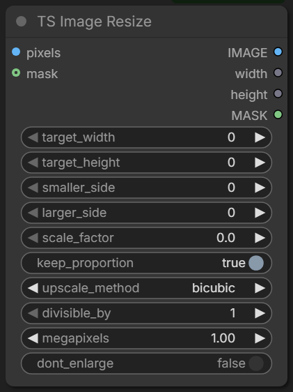

Тот самый ресайз, который вам действительно нужен. Выбирайте один из режимов: точные размеры (`target_width` × `target_height`), одна сторона (`smaller_side` / `larger_side`), мегапиксели или коэффициент масштаба. Опция `divisible_by` подгоняет результат под кратность, нужную семплерам (8, 16, 32, …). `dont_enlarge` запрещает увеличение, если исходник уже меньше цели.

**Когда использовать:** подготовка входов для SDXL / Flux / WAN, batch-ресайз фото к максимальной стороне, унификация размеров видео.

---

#### TS Resolution Selector
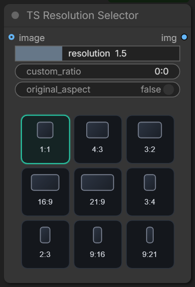

Визуальный выбор соотношения сторон. Доступны 1:1, 4:3, 3:2, 16:9, 21:9, 3:4, 2:3, 9:16, 9:21 или произвольное соотношение, плюс целевой бюджет в мегапикселях (0.5 – 4 МП). На выходе — пустое полотно с размерами, кратными 32, идеально как `latent_image`. Если подключить картинку, нода впишет её на полотно; с `original_aspect=True` соотношение берётся из картинки, а не пресета.

**Когда использовать:** старт генерации с фиксированной пропорцией, нормализация произвольной картинки в latent-сетку.

---

#### TS Qwen Safe Resize
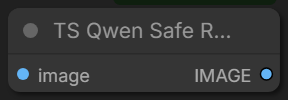

Ресайз в один клик к ближайшему официальному разрешению Qwen-Image (1344×1344, 1792×1008 и т.п.). Подбирает поддерживаемый размер по ближайшему соотношению сторон и центр-кропит.

**Когда использовать:** перед подачей в Qwen-Image / Qwen-Edit, чтобы избежать ошибок несовпадения разрешения.

---

#### TS Qwen Canvas
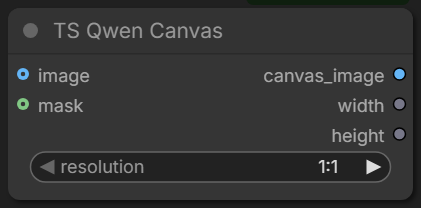

Создаёт пустое Qwen-Image-полотно в одном из поддерживаемых разрешений и опционально вставляет вашу картинку в центр (с mask-aware кропом, если подать маску).

**Когда использовать:** нужен Qwen-friendly размер полотна и автоматическая вставка референса.

---

#### TS WAN Safe Resize
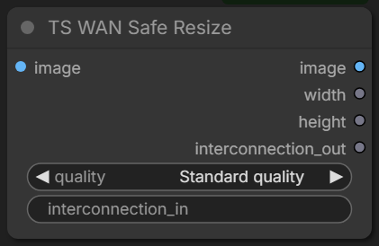

Аналог Qwen Safe Resize, но для WAN-Video. Определяет ближайшую пропорцию (16:9, 9:16, 1:1) и выбирает один из трёх пресетов качества: Fast (240p), Standard (480p / 832p), High (720p / 1280p). Строка `interconnection_in/out` позволяет нескольким WAN-нодам делиться одним уровнем качества.

**Когда использовать:** подготовка кадров для WAN i2v / t2v моделей.

---

#### TS Color Grade
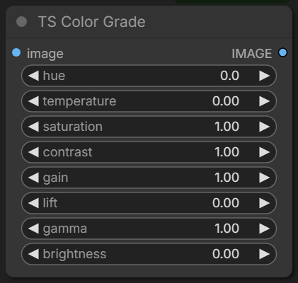

Восемь ручек цветокоррекции в одной ноде: `hue`, `temperature`, `saturation`, `contrast`, `gain`, `lift`, `gamma`, `brightness`. По функционалу ≈ базовая страница в DaVinci Resolve.

**Когда использовать:** подгонка кадров под общий тон, "согревание" холодных рендеров, исправление плоских картинок, стилизация.

---

#### TS Color Match
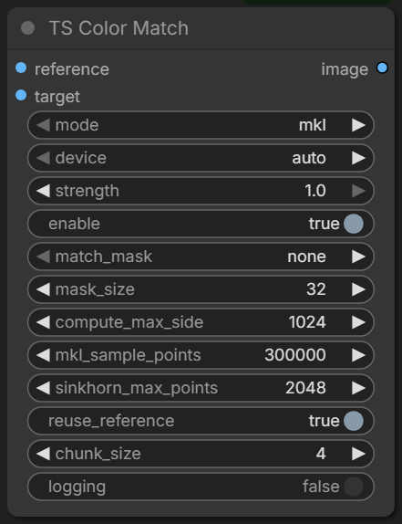

Перенос цветовой палитры с `reference` на `target` батч. Два алгоритма:

- **MKL** (по умолчанию) — быстро, стабильно, дружелюбно к видео с временным сглаживанием.
- **Sinkhorn** — медленнее, но точнее (на основе оптимального транспорта).

В комплекте: маски совпадения (`rectangle` / `ellipse` для стабилизации только по краям), VRAM-aware чанкинг, флаг `reuse_reference` для видео.

**Когда использовать:** колор-грейдинг видео по одному ключевому кадру, сведение кадров из разных источников, вписывание CG в plate-видео.

---

#### TS Film Emulation
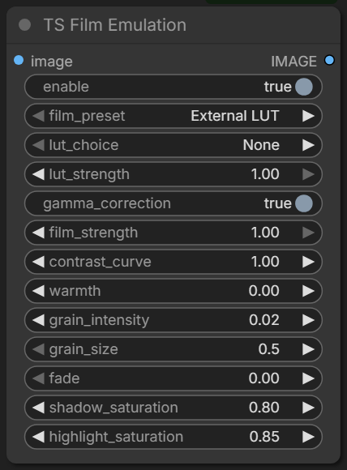

Встроенные пресеты плёнки (Kodak Portra/Vision3, Fuji, Cineon-style, …) плюс возможность подгрузить свой `.cube` LUT из `models/luts/`. Гамма-коррекция, кривая контраста и регулируемая `lut_strength`.

**Когда использовать:** придание рендерам кинематографичного оттенка, не уходя из графа.

---

#### TS Film Grain
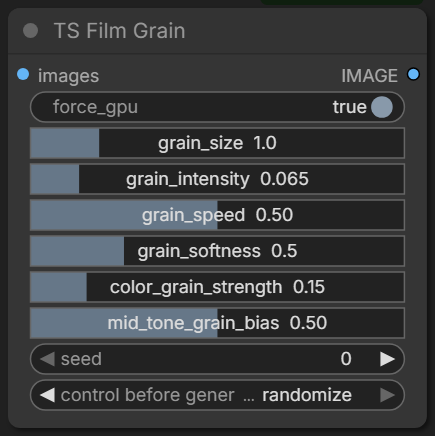

Трёхоктавное органичное плёночное зерно. Регулируйте `grain_size`, `intensity`, `softness` и `mid_tone_grain_bias` для реалистичного распределения (больше зерна в полутонах, меньше в светах/тенях). `grain_speed` управляет тем, насколько паттерн зерна меняется от кадра к кадру в видео.

**Когда использовать:** разрушить "чистый ИИ-вид" или подогнать под плёночную эстетику.

---

#### TS Remove Background (BiRefNet)
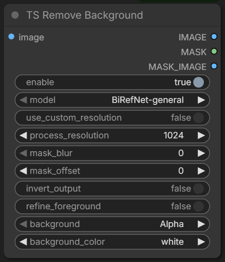

State-of-the-art удаление фона через BiRefNet. На выходе: вырезанная картинка, альфа-маска и "preview" маски. Опции: выбор модели (HR-matting / general / portrait / DIS), `process_resolution` (с override через `use_custom_resolution`), `precision` (auto/fp16/fp32), `mask_blur`, `mask_offset`, `invert_output`, `temporal_smooth` для видео (`none`/`median3`/`ema` с `ema_alpha`), фон (Alpha / цвет через COLOR-виджет). В v9.4 убран нестабильный `refine_foreground`.

**Когда использовать:** изоляция объектов, продуктовая съёмка, чистые альфа-маски для композа.

---

#### TS Keyer
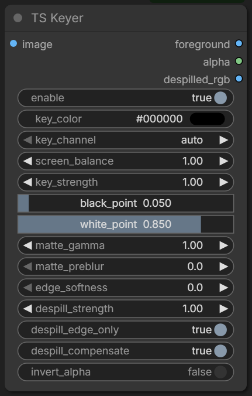

Профессиональный chroma keyer для зелёного/синего/красного фона. Color-difference matte, despill, сглаживание краёв, matte gamma и инверсия. На выходе RGBA-foreground, alpha-маска и despilled RGB — готово к композу.

**Когда использовать:** вытащить актёра с зелёного фона, убрать однотонный фон, вписать CG.

---

#### TS Despill
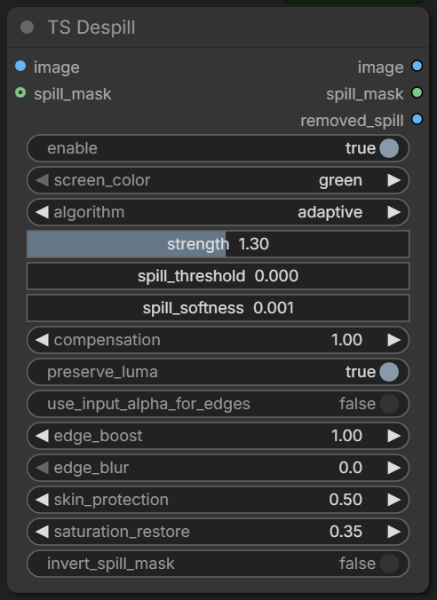

Отдельный despill с четырьмя алгоритмами: `classic`, `balanced`, `adaptive` (edge-aware), `hue_preserve`. Поддерживает опциональную маску спилла, защиту телесных оттенков и восстановление насыщенности. Применяется после отдельного keyer'а или прямо на plate-видео с цветовой засветкой.

**Когда использовать:** убрать зелёные/синие/красные блики на волосах или коже без потери цветопередачи.

---

#### TS Lama Cleanup
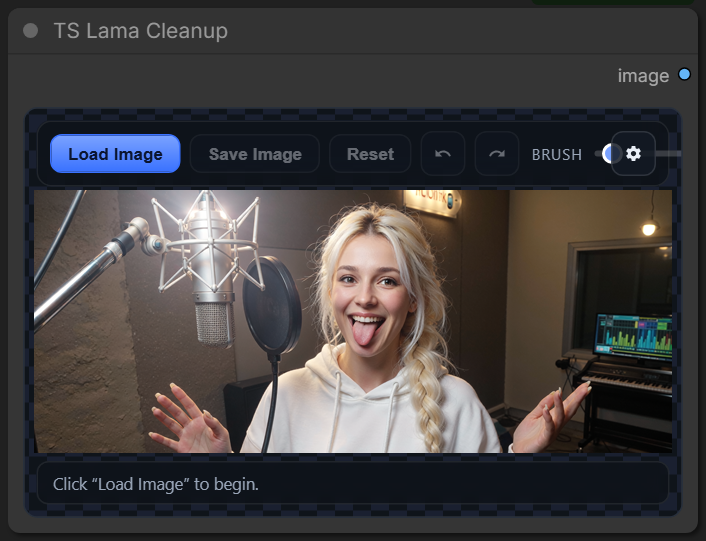

Встроенный инпейнтинг через LaMa — рисуйте маску прямо на канвасе ноды (кисть + undo/redo + reset), затем запускайте, чтобы заполнить. Хранит промежуточные правки по сессиям, не нужно ходить в Photoshop. С v9.3 архитектура — чистый PyTorch (без зависимости от upstream `lama-cleaner`), веса загружаются из `.safetensors` в `models/lama/`, а не из pickled `.ckpt`.

**Когда использовать:** убрать туристов с фото, стереть водяные знаки, починить артефакты, прототипировать чистку перед тяжёлым inpainter'ом.

---

#### TS Matting (ViTMatte)

Guided alpha matting через Hugging Face ViTMatte. На вход — изображение + грубая маска (например, из SAM3 Detect), нода авто-строит trimap и уточняет маску до фотореалистичного альфа-канала. Такой же набор пост-обработки `mask_blur`/`mask_offset`/`background`, как у TS Remove Background, — drop-in замена, когда важны края, волосы и полупрозрачность. Модели кэшируются в `models/vitmatte/`.

**Когда использовать:** получить чистый cut-out из SAM-style маски без захода в Photoshop.

---

#### TS SAM Media Loader

Загружает изображение или видео и позволяет накликать позитивные/негативные точки прямо на превью первого кадра. На выходе: `IMAGE`, `AUDIO` (для видео) и `positive_coords`/`negative_coords` — STRING JSON ровно в том формате, который ждут нативные ComfyUI ноды **SAM3 Detect** / **SAM3 Video Track**. С опциональным входом `model` (SAM3) дополнительно отдаёт рендер `initial_mask`, готовый идти в `SAM3 Video Track`.

**Когда использовать:** строите SAM3-сегментацию/трекинг и хотите кликабельный UI для seed-точек вместо ручного ввода JSON.

---

#### TS Crop To Mask
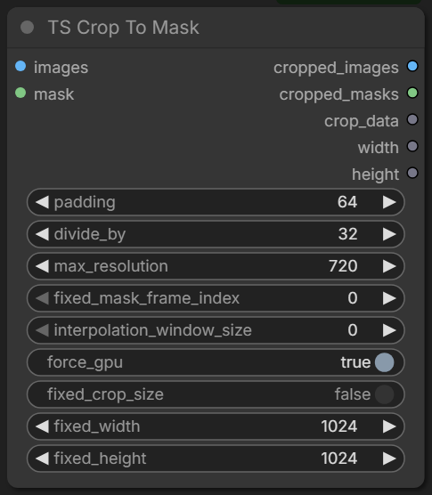

Кропит батч изображений вокруг маски с настраиваемым padding'ом, ограничением максимального разрешения, фиксированным aspect и межкадровым сглаживанием для стабильности видео. На выходе кроп + блоб `crop_data` для…

---

#### TS Restore From Crop
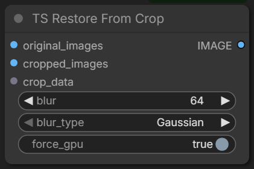

…этой ноды, которая возвращает обработанный кроп обратно в исходный кадр с feathered Gaussian/box blur'ом по швам. Классический crop-and-restore для обработки только интересующей области тяжёлой моделью.

**Когда использовать в паре:** прогнать апскейлер или face-restorer на маленьком ROI большого изображения без расхода VRAM на весь кадр.

---

#### TS Image Tile Splitter
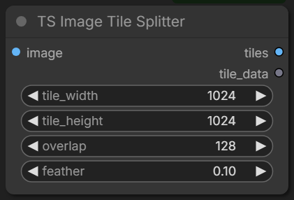

Режет большое изображение на перекрывающиеся тайлы для тайловой обработки. Настраивается размер тайла, перекрытие и feather. На выходе батч тайлов + метаданные `TILE_INFO`.

---

#### TS Image Tile Merger
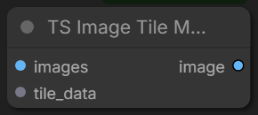

Вторая половинка пары: берёт обработанные тайлы и `TILE_INFO`, склеивает обратно в одно изображение с feathered-смешиванием в зонах перекрытия.

**Когда использовать в паре:** тайловый апскейл, шумоподавление или любой процесс, для которого 4K кадр не помещается в VRAM.

---

#### TS Auto Tile Size
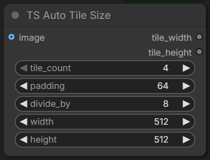

Выберите `tile_count` (4, 8, 16) — нода вычислит оптимальные `tile_width` × `tile_height` с учётом padding'а и `divide_by`. Отлично сочетается со splitter'ом/merger'ом выше.

---

#### TS Cube to Equirectangular
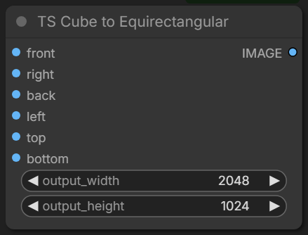

Шесть граней куба (front/right/back/left/top/bottom) → одна эквиректангулярная 360° панорама нужного размера.

---

#### TS Equirectangular to Cube
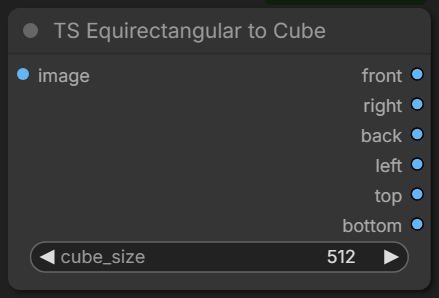

Обратное преобразование: эквиректангулярная панорама → шесть граней куба заданного `cube_size`.

**Когда использовать в паре:** генерация 360°-контента (Skybox AI, equirect-aware diffusion) с конвертацией между форматами.

---

#### TS Image Batch Cut
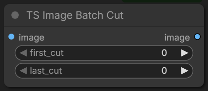

Обрежьте N кадров с начала (`first_cut`) и N кадров с конца (`last_cut`) у батча изображений. Отрицательные значения → ноль; over-cut возвращает пустой батч.

**Когда использовать:** обрезать вступление/окончание видео, выкинуть warm-up кадры семплера, разделить батч на сегменты.

---

#### TS Image Batch to Image List / TS Image List to Image Batch
<table>
<tr>
<td>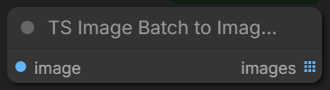</td>
<td>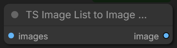</td>
</tr>
</table>

Конвертация между `IMAGE` (один батчевый тензор) и `IMAGE`-list (Python-список одиночных тензоров). Нужно, когда одна нода ожидает батч, а следующая хочет покадровую итерацию.

---

#### TS Get Image Megapixels
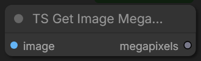

Возвращает количество мегапикселей `IMAGE` как `FLOAT`. Двухстрочная нода, но незаменима для роутинга ("если картинка > 4 МП, сначала уменьшить").

---

#### TS Get Image Size
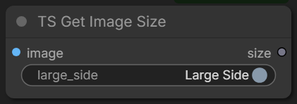

Возвращает большую или меньшую сторону изображения как `INT`. Переключатель меняет режим.

---

#### TS Image Prompt Injector
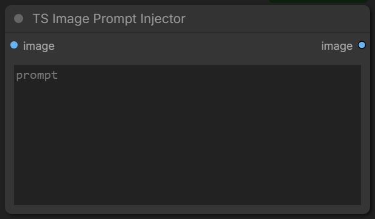

Вставляет произвольную строку в позитивный промпт workflow'а во время выполнения — полезно, когда промпт генерируется динамически (LLM-ноды) и должен попасть в реальный `CLIPTextEncode`, подключённый к семплеру. Работает с графом workflow'а, изображение не меняет.

**Когда использовать:** связка LLM, который пишет промпт, → семплер должен использовать результат без ручной перепроводки text encoder'ов.

---

<a id="video"></a>
### 🎬 Видео (7 нод)

Интерполяция кадров, model-based апскейл, глубина, превью анимации и гигиена VRAM.

#### TS Animation Preview
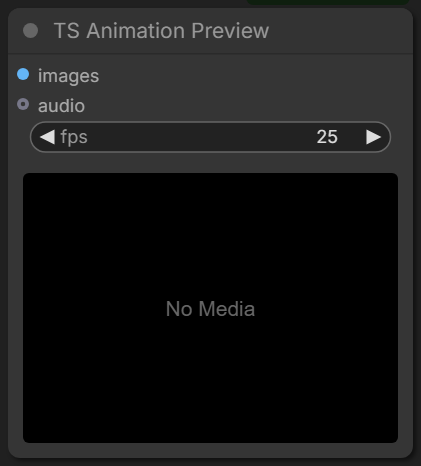

Готовая нода-превью для батчей изображений. Прямо в ноде показывает зацикленный H.265-ролик с опциональной звуковой дорожкой. Лучше, чем гонять семплер второй раз ради просмотра анимации.

**Когда использовать:** превью видео-выдачи перед тем, как тратить VRAM на финальный энкод; QA результатов интерполяции.

---

#### TS Frame Interpolation
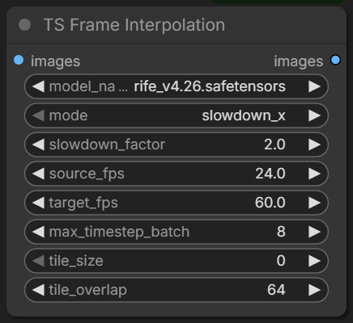

Плавная интерполяция кадров через RIFE / FILM. Поднимите 12 fps анимацию до 24/48/60 fps или сгладьте дёрганое видео.

**Когда использовать:** выдача модели "рваная", и вы хотите кинематографичной плавности.

---

#### TS Video Upscale With Model
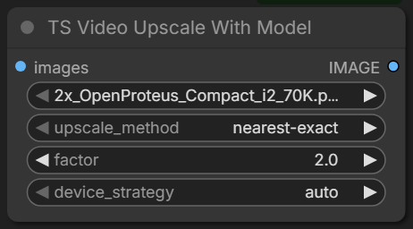

Покадровый апскейл любой моделью, поддерживаемой spandrel (RealESRGAN, 4x-Ultrasharp и т.п.). Три стратегии устройства: `auto`, `load_unload_each_frame` (мало VRAM, медленно), `keep_loaded` (быстро, больше VRAM), `cpu_only`.

**Когда использовать:** апскейл видео без OOM или batch-апскейл с контролируемым расходом VRAM.

---

#### TS RTX Upscaler
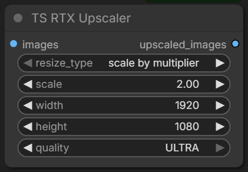

Аппаратный апскейл через NVIDIA RTX Video Super Resolution (`nvvfx`). Четыре уровня качества (LOW/MEDIUM/HIGH/ULTRA), батчевая обработка. **Требуется RTX-видеокарта.**

**Когда использовать:** есть RTX и нужна скорость света для видео-апскейла.

---

#### TS Video Depth
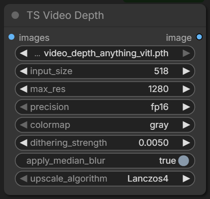

Покадровое определение глубины через Depth-Anything, оптимизированное для видео (временна́я согласованность). В v9.4 — полная переделка GPU-пайплайна: SDPA-attention, TPDF-дизеринг на выходе, sub-chunk обработка длинных клипов, численно-эквивалентный DPT tail. Результат тот же, скорость на RTX-картах резко выше.

**Когда использовать:** depth-aware ControlNet, parallax-эффекты, 3D-репроекция.

---

#### TS LTX First/Last Frame
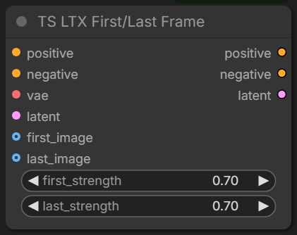

Применяет LTX-Video keyframe conditioning для первого и (опционально) последнего кадра в одной ноде — эквивалент цепочки из двух `LTXVAddGuide`, но без визуальной каши.

**Когда использовать:** есть конкретные начальный/конечный кадры, хотите чтобы LTX интерполировал между ними.

---

#### TS Free Video Memory
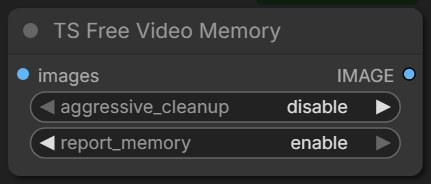

Pass-through нода, которая запускает `gc.collect()` + `torch.cuda.empty_cache()` (опционально `caching_allocator_delete_caches()`) между тяжёлыми шагами. Сообщает память до/после.

**Когда использовать:** в цепочке нескольких VRAM-голодных видео-нод нужна явная очистка между ними.

---

<a id="audio"></a>
### 🎵 Аудио (5 нод)

Speech-to-text, text-to-speech, разделение на стемы плюс дружелюбный загрузчик и превью аудио.

#### TS Audio Loader
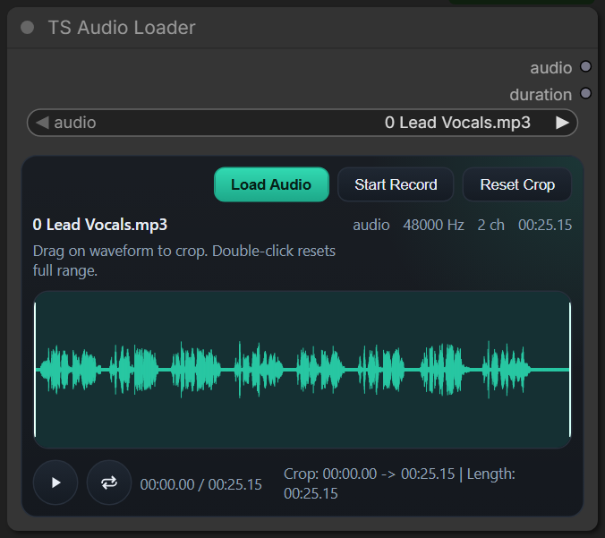

Аудио-загрузчик, который вы бы написали сами, будь у вас время. Грузит аудио из любого медиа (mp3/wav/mp4/mov/…), показывает реальную waveform-волну, позволяет визуально кропать перетаскиванием по волне и даже записывать с микрофона прямо в ноде. На выходе — `AUDIO` waveform и `duration` в int.

**Когда использовать:** подготовка озвучки, музыкальной подложки или любого аудио, которое нужно подрезать.

---

#### TS Audio Preview
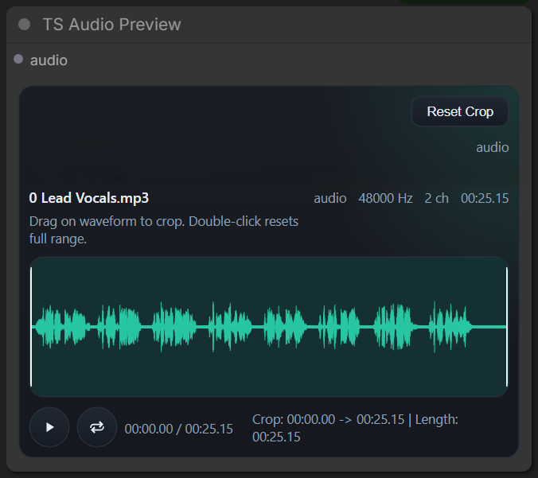

Та же waveform-UI, что и у Audio Loader, но для прослушивания аудио-выхода upstream-ноды. Зацикленное воспроизведение, диапазоны кропа, persistent state.

**Когда использовать:** прослушать результат TTS / разделения стемов / обработки без сохранения файла.

---

#### TS Whisper
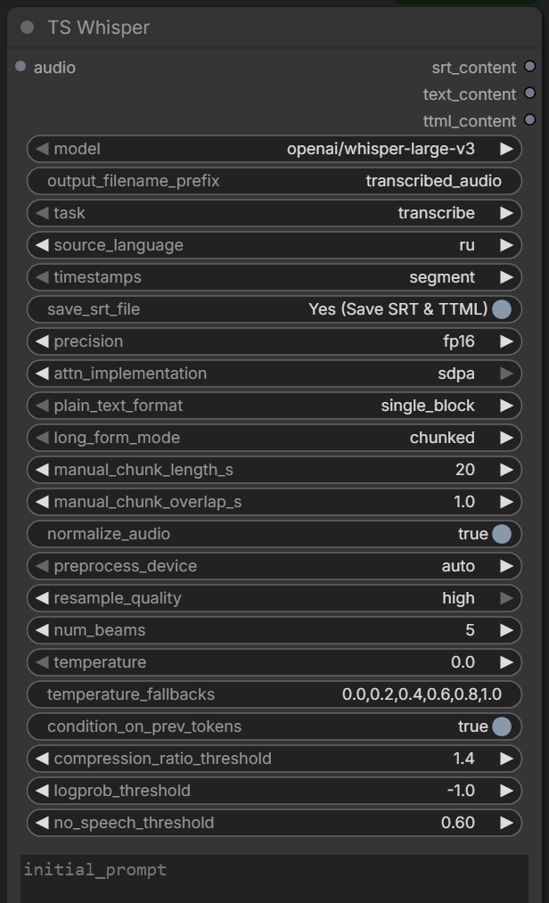

Speech-to-text через OpenAI Whisper. Сразу три формата: SRT (с тайм-кодами), plain text, TTML. Настраиваемый beam search, язык, temperature fallbacks и OOM-aware retries.

**Когда использовать:** транскрипция озвучки, генерация субтитров, выдёргивание текста из подкастов перед LLM-обработкой.

---

#### TS Silero TTS
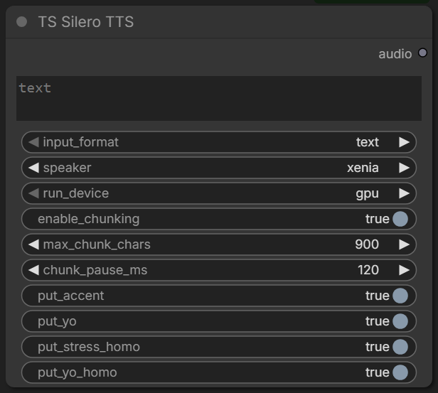

Русский text-to-speech через Silero TTS v5_3. Пять голосов (aidar, baya, kseniya, xenia, eugene), text или SSML на входе, автоматическая нарезка длинных текстов на куски.

**Когда использовать:** русскоязычная озвучка, черновики аудиокниг, нарезка для YouTube.

---

#### TS Music Stems
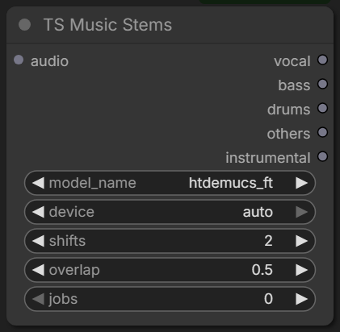

Разделение музыки на источники через Demucs. Любое аудио → четыре `AUDIO`-выхода: `vocal`, `bass`, `drums`, `others`. Три модели на выбор (`htdemucs`, `htdemucs_ft`, `hdemucs_mmi`), TTA shifts и overlap для повышения качества.

**Когда использовать:** изоляция вокала для ремикса, караоке-инструментал, чистые стемы для другой модели.

---

<a id="llm"></a>
### 🤖 LLM (2 ноды)

Мультимодальный prompt-enhancement и понимание изображений через локальные LLM.

#### TS Qwen 3 VL V3
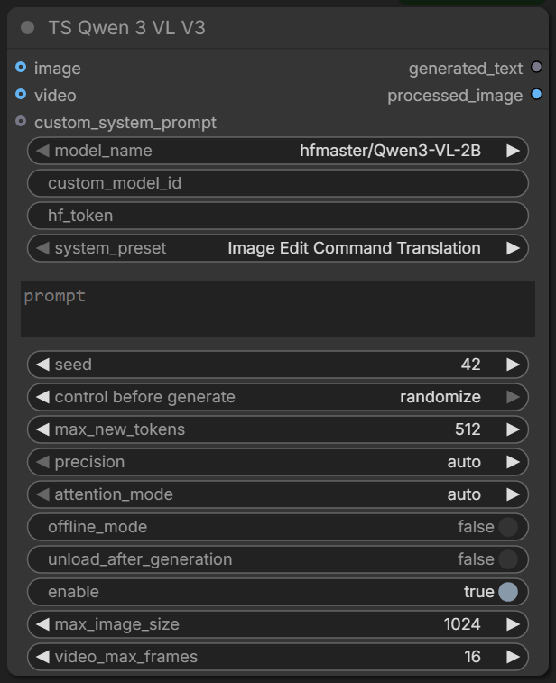

Мультимодальный Qwen 3 VL (image + video + text) локально. Встроенный выбор модели (Qwen 2B / 4B / 8B и uncensored-варианты), пресеты системных промптов ("Image Edit Command Translation", "Prompt Enhancement", …), 4-bit/8-bit квантование через `bitsandbytes`, поддержка FlashAttention-2, скачивание с HuggingFace на лету. С v9.5 тяжёлый пайплайн вынесен в общий `nodes/llm/_qwen_engine.py`, который переиспользует Super Prompt — исправления и оптимизации применяются к обеим нодам одновременно.

**Когда использовать:** описание изображений для промптов, перевод намерений пользователя в команды редактирования, VLM-driven пайплайны.

---

#### TS Super Prompt
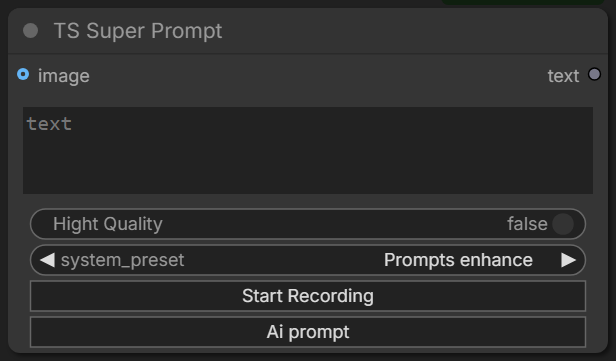

Нода-улучшайзер промптов со встроенной **голосовой кнопкой** — скажите идею, Whisper её транскрибирует (с грамматикой, заточенной под cinematography), маленький Qwen3 раскрывает в насыщенный промпт. Опциональный image input для image-conditioned промптов. Два режима: быстрый turbo и high-quality. Внутренности в v9.5 разнесены по `nodes/llm/super_prompt/` (`_helpers`, `_voice`, `_qwen` поверх общего Qwen-engine) — путь prompt enhancement идёт в ногу с TS Qwen 3 VL V3.

**Когда использовать:** быстрый брейншторм промптов, голосовые workflow'ы, превращение сырой идеи в production-ready промпт.

---

<a id="text"></a>
### 📝 Текст и промпты (4 ноды)

Сборка, рандомизация и менеджмент промптов в масштабе.

#### TS Prompt Builder
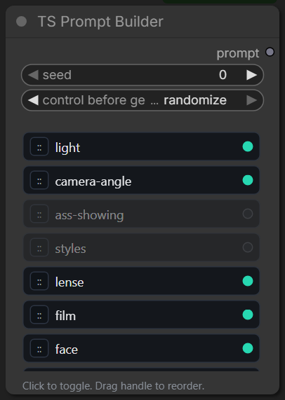

Composable prompt builder. Редактируйте промпт как список переключаемых блоков (light, camera-angle, lens, film, face, …), которые лежат в `.txt` файлах в `nodes/prompts/`. Drag-перетаскивание для порядка, клик — включить/выключить, seed выбирает случайную строку из каждого включённого блока. Сохраняет порядок и состояние блоков между сессиями.

**Когда использовать:** прогон батча с контролируемой вариацией промпта — каждый блок это категория, каждая строка — вариант.

---

#### TS Batch Prompt Loader
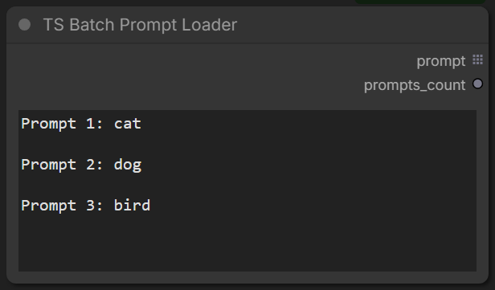

Вставьте многострочный текст, где промпты разделены пустыми строками — на выходе список промптов и их количество.

```
Промпт 1: кот на подоконнике

Промпт 2: собака на пляже

Промпт 3: птица на ветке
```

**Когда использовать:** прогон батча разных промптов через один и тот же workflow без ручной подачи каждого.

---

#### TS Style Prompt Selector
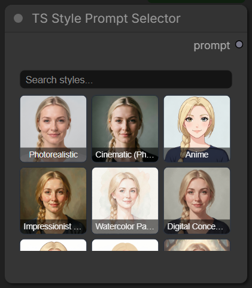

Визуальный выбор стиля. Готовые стили (Photorealistic, Cinematic, Anime, Impressionist, Watercolor, Digital Concept Art, …) с превью. Выбираете один — получаете соответствующий фрагмент промпта как `STRING`.

**Когда использовать:** быстрая стилизация генерации без переписывания одной и той же фразы "in the style of …".

---

#### TS Silero Stress
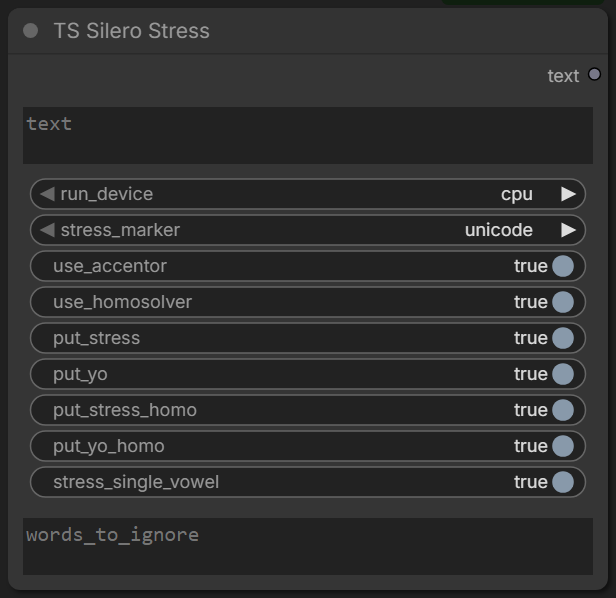

Препроцессор русского текста: расставляет ударения (Unicode acute или Silero `+`-нотация) и восстанавливает буквы `ё`. Два алгоритма (правила-based accentor + нейросеть-разрешитель омографов), которые можно включать независимо.

**Когда использовать:** подготовка русского текста для TTS, чтобы избежать неправильного произношения; учебные материалы с проставленными ударениями.

---

<a id="files"></a>
### 📁 Файлы и модели (8 нод)

Инструменты для управления модельными файлами, скачиваниями, EDL и инспекции весов.

#### TS Files Downloader (Ultimate)
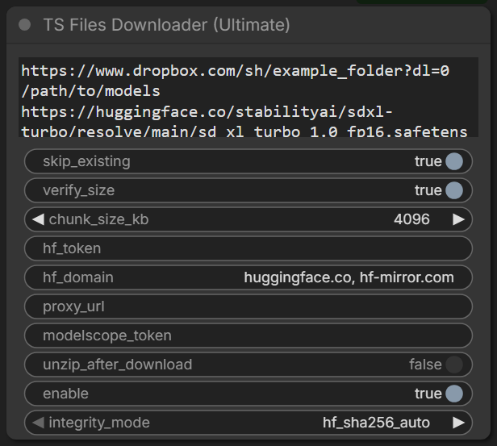

Multi-file загрузчик, который принимает список строк формата `URL <пробел> target_path` и скачивает их последовательно. Автоматически подменяет HuggingFace-зеркала с проверкой доступности по всему списку зеркал, поддерживает `models/<subdir>` алиасы, докачивает прерванные файлы, защищает auto-unzip от zip-slip, показывает прогресс (включая верификацию SHA256). Удобно отдавать workflow с готовым списком моделей.

**Когда использовать:** распространение workflow'а, которому нужны N конкретных моделей — пользователю достаточно подать готовую ноду с URL-ами.

---

#### TS Model Scanner
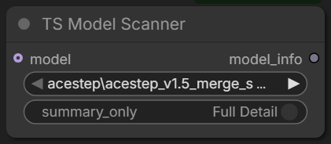

Инспекция любого `.safetensors` (из `models/diffusion_models/`) или загруженного `MODEL`. Печатает подробный отчёт: имя, shape, dtype, device каждого параметра + сводная статистика по dtype.

**Когда использовать:** дебаг загрузки модели, проверка точности (fp16 vs fp8 vs bf16), знакомство с незнакомым чекпоинтом.

---

#### TS Model Converter
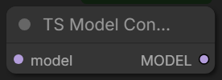

In-memory FP8-конвертация (`float8_e4m3fn`) загруженной `MODEL`. Сокращает VRAM вдвое на поддерживаемых GPU.

---

#### TS Model Converter Advanced
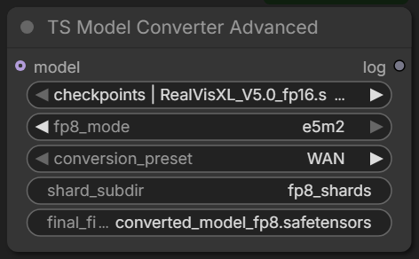

Та же идея с тонкой настройкой: выбор целевого dtype (fp8 e4m3 / e5m2, bf16, fp16, fp32), keyword-фильтры по слоям и опции загрузки/сохранения.

---

#### TS Model Converter Advanced Direct
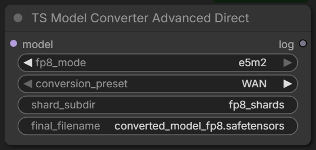

То же, что Advanced, но пишет конвертированные веса напрямую на диск — без in-memory roundtrip.

**Когда использовать тройку:** подготовка FP8 / mixed-precision вариантов больших моделей для слабого железа; тестирование влияния точности на качество.

---

#### TS CPU LoRA Merger
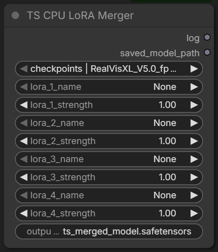

Слияние LoRA-весов в базовую модель на CPU — VRAM не нужна, подходит для огромных моделей, не помещающихся в GPU.

**Когда использовать:** запекание LoRA в чекпоинт для распространения; слияние нескольких LoRA без GPU.

---

#### TS File Path Loader
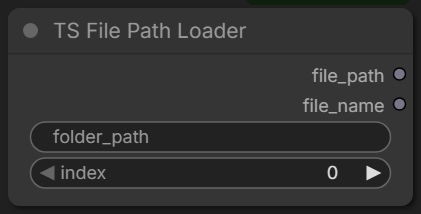

Берёт N-й файл из папки в порядке сортировки. На выходе полный путь и имя без расширения. Фильтрует по поддерживаемым ComfyUI расширениям (`.safetensors`, `.ckpt`, `.pt`, `.mp4`, `.mov`, …). Индексы зацикливаются.

**Когда использовать:** итерация по папке входов в очереди; выбор последнего чекпоинта по индексу.

---

#### TS YouTube Chapters
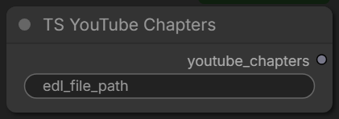

Конвертирует EDL (Edit Decision List) экспорт DaVinci Resolve в YouTube-friendly список глав. Читает тайм-коды маркеров, нормализует к часовой baseline, форматирует как `MM:SS Имя маркера`.

**Когда использовать:** публикация туториал-видео, для которых главы уже размечены в монтажке.

---

<a id="utils"></a>
### 🛠️ Утилиты (4 ноды)

Маленькие помощники, чтобы граф меньше захламлялся.

#### TS Int Slider
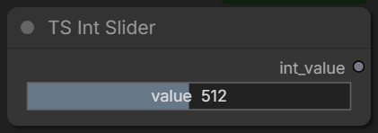

Чистый integer-слайдер, возвращающий `INT`. Кастомный UI оптимизирован под ручки разрешения / количества.

---

#### TS Float Slider
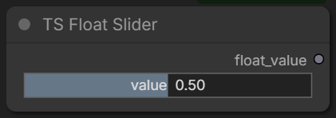

Float-аналог, диапазон −1e9 … +1e9 с точностью 0.01 по умолчанию.

**Когда использовать пару:** нужен чистый виджет параметра без перетаскивания полноценной math-ноды на граф.

---

#### TS Math Int
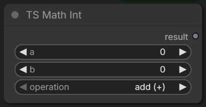

Двухвходовая integer-математика: `+`, `-`, `*`, `/`, `//`, `%`, `**`, `min`, `max`. Деление на ноль возвращает 0 (с error-логом) вместо падения графа.

**Когда использовать:** вычисление количества тайлов, индексов кадров, размеров батча или любой целочисленной арифметики, неудобной через Primitive-ноды.

---

#### TS Smart Switch
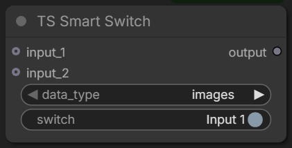

Type-aware булев свитч между двумя `ANY`-входами. Выбираете `data_type` (images / video / audio / mask / string / int / float), нода валидирует, что входы соответствуют. **Auto-failover**: если выбранный вход отсутствует — fallback на другой. Идеально для опциональных веток.

**Когда использовать:** ветвление workflow по флагу или опциональный вход с разумным fallback'ом.

---

<a id="conditioning"></a>
### 🎨 Conditioning (1 нода)

#### TS Multi Reference
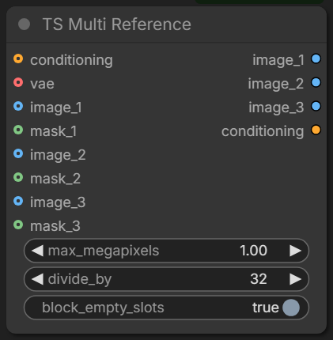

Добавляет до трёх референсных изображений в conditioning как `reference_latents`. Сделана для Qwen-Image-Edit и подобных multi-reference пайплайнов. Per-slot выходы (`image_1` / `image_2` / `image_3`) с `ExecutionBlocker` для неподключённых слотов, автоматический resize к мегапиксельному бюджету с выравниванием по делителю (по умолчанию 32). Корректно обрабатывает RGBA + MASK-входы (композит на белый фон).

**Когда использовать:** Qwen-Edit / Flux-with-references пайплайны, принимающие несколько референсов.

---

## 🔰 Подсказки для новичков

### Только начинаете?

1. **Ищите по категориям** в правом клике: каждая нода живёт под `TS/<Категория>`.
2. **Доверяйте дефолтам**: у каждого входа есть разумное значение по умолчанию. Меняйте по одному параметру, чтобы понять, что он делает.
3. **Используйте [TS Resolution Selector](#image)** как источник latent-изображения — он всегда возвращает sampler-friendly размер.
4. **Бросьте [TS Animation Preview](#video) в конец** любого видео-графа, чтобы делать QA без перезапуска.
5. **Нужен быстрый голосовой промпт?** [TS Super Prompt](#llm) — кликнули по микрофону, описали идею, получили готовый промпт.

### VRAM не хватает, что использовать?

| Задача | Решение |
|---|---|
| Апскейл 4K-картинки | TS Image Tile Splitter → апскейлер → TS Image Tile Merger |
| Обработать только лицо/объект | TS Crop To Mask → апскейл/restore → TS Restore From Crop |
| Освободить VRAM посреди графа | TS Free Video Memory между тяжёлыми шагами |
| FP8 модель | TS Model Converter Advanced |

### Где модели лежат?

| Нода | Папка по умолчанию |
|---|---|
| TS Lama Cleanup | `models/lama/` |
| TS Whisper | `models/whisper/` |
| TS Silero TTS | `models/silerotts/` |
| TS Silero Stress | `models/silero-stress/` |
| TS Qwen 3 VL | `models/LLM/` |
| TS Super Prompt | `models/LLM/` |
| TS Music Stems | demucs default cache |

Можно переопределить через `extra_model_paths.yaml` — Timesaver уважает path-resolution ComfyUI.

---

## 🛟 Если что-то сломалось

<details>
<summary><b>"Module not found" при старте</b></summary>

Смотрите startup-лог — Timesaver печатает load report. Отсутствующие опциональные зависимости появляются под **Optional missing imports** с указанием, какому файлу они нужны. Установите:

```bash
python -m pip install <missing_module>
```

Используйте тот же Python, что запускает ComfyUI. На Windows portable: `python_embeded\python.exe -m pip install <module>`.
</details>

<details>
<summary><b>Нода не появилась в меню</b></summary>

В startup-логе ищите **Module load issues**. Самая частая причина — отсутствие опциональной зависимости (например `py360convert` нужен для cube/equirect нод). Установите её и перезапустите.
</details>

<details>
<summary><b>Workflow ломается после обновления</b></summary>

Timesaver специально замораживает id нод и входы между версиями. Если что-то сломалось после `git pull`:
1. Проверьте `doc/migration.md` на breaking changes.
2. Убедитесь, что `pip install -r requirements.txt` запускался.
3. Полностью перезапустите ComfyUI — не просто обновите вкладку браузера.
</details>

<details>
<summary><b>OOM (out of memory)</b></summary>

- Вставьте `TS Free Video Memory` между тяжёлыми нодами.
- Уменьшите `process_resolution` (BiRefNet) или `compute_max_side` (Color Match).
- Для апскейла используйте `TS Image Tile Splitter` + тайловую обработку.
- Для LLM понизьте точность до int8 или int4 (`TS Qwen 3 VL V3` → `precision=int8`).
- `unload_after_generation=True` освобождает VRAM модели после каждого запуска.
</details>

---

## 🗂️ Структура репозитория

```text
comfyui-timesaver/
├─ nodes/                  # 59 модулей нод по категориям
├─ js/                     # frontend extensions для DOM-widget нод
├─ doc/screenshots/        # скриншоты нод (этот README их использует)
├─ requirements.txt        # runtime-зависимости
└─ pyproject.toml          # версия + ComfyRegistry-метаданные
```

---

## 📜 Лицензия и благодарности

Лицензия — см. [LICENSE.txt](LICENSE.txt).

**Построено на:**
- [ComfyUI](https://github.com/comfyanonymous/ComfyUI) — graph engine и V3 API.
- [BiRefNet](https://github.com/zhengpeng7/BiRefNet) — удаление фона.
- [LaMa](https://github.com/advimman/lama) — image inpainting.
- [Whisper](https://github.com/openai/whisper) — распознавание речи.
- [Demucs](https://github.com/facebookresearch/demucs) — разделение музыки на источники.
- [Silero](https://github.com/snakers4/silero-models) — русский TTS / ударения.
- [Qwen](https://github.com/QwenLM/Qwen3-VL) — vision-language модель.
- [Spandrel](https://github.com/chaiNNer-org/spandrel) — загрузка апскейлеров.
- [py360convert](https://github.com/sunset1995/py360convert) — 360° конвертация.
- [RIFE](https://github.com/megvii-research/ECCV2022-RIFE) / [FILM](https://github.com/google-research/frame-interpolation) — интерполяция кадров.

**Мейнтейнер:** [@AlexYez](https://github.com/AlexYez)

**Issues / feature requests:** https://github.com/AlexYez/comfyui-timesaver/issues

---

<div align="center">

**Понравилось?** ⭐ Поставьте звезду, чтобы помочь другим найти проект.

</div>
